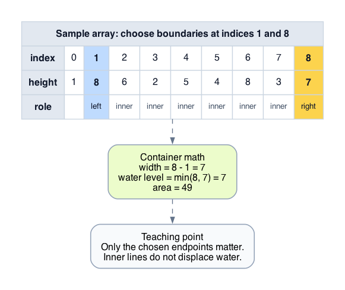
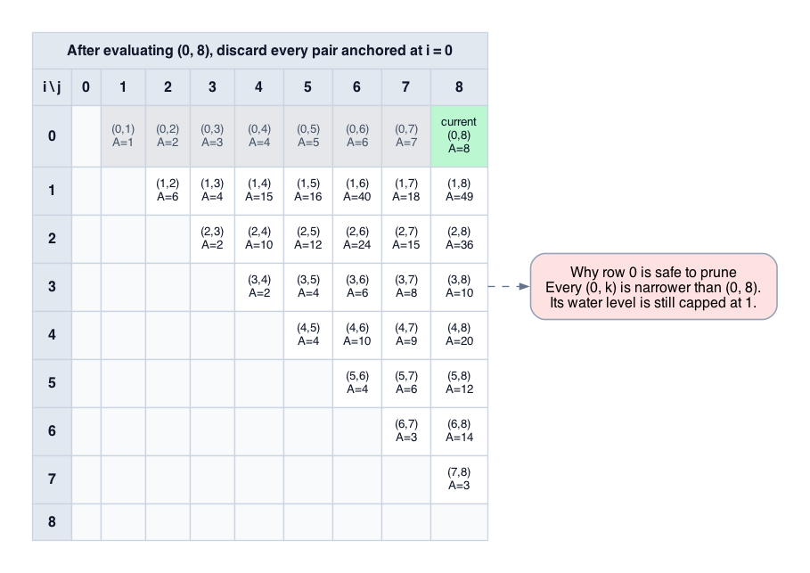
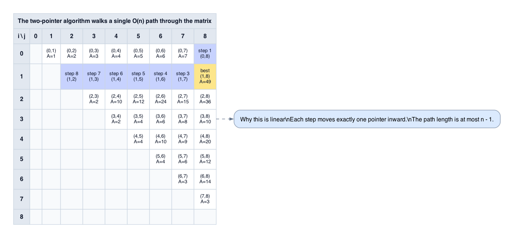
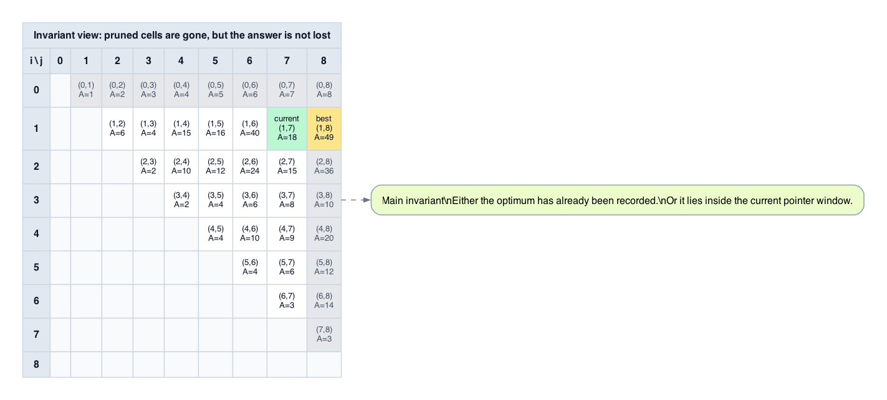

# Problem Metadata
- **LeetCode Number:** 11
- **Difficulty:** Medium
- **Topic Tags:** Array, Two Pointers, Greedy
- **Primary Pattern:** Two Pointers (State Space Pruning)
- **Secondary Pattern:** Greedy Choice
- **Why Interviewers Ask This:** The problem is easy to execute and hard to justify. The real test is whether you can prove that discarding the shorter boundary never removes the optimum.

# Problem Contract & Hidden Semantics
Given a non-negative array `height[0..n-1]`, choose indices `i < j`. The two chosen lines and the x-axis form a container with area
\[
A(i,j) = (j-i)\min(H[i], H[j]).
\]
Return the maximum such area.

- **Only the endpoints matter.** Interior lines do not affect the area of the current container once `i` and `j` are fixed.
- **The shorter endpoint is the bottleneck.** The water level is capped by `min(H[i], H[j])`, so changing only the taller side cannot raise the current pair's height.
- **Width is tied to the original indices.** Sorting the heights destroys the distances that define the objective.
- **The output is the value, not the pair.** We only need the maximum area unless a follow-up explicitly asks for indices.
- **Non-negativity matters.** Since all heights are non-negative, all candidate areas are non-negative, so initializing `best = 0` is sound.

# Worked Example by Hand
Consider `height = [1, 8, 6, 2, 5, 4, 8, 3, 7]`.

| Step | `i` | `j` | `H[i]` | `H[j]` | Width | Area | Best So Far | Move |
|:---:|:---:|:---:|:---:|:---:|:---:|:---:|:---:|:---|
| 1 | 0 | 8 | 1 | 7 | 8 | `8 * min(1,7) = 8` | 8 | Move `i` because `H[0] < H[8]` |
| 2 | 1 | 8 | 8 | 7 | 7 | `7 * min(8,7) = 49` | 49 | Move `j` because `H[8] < H[1]` |
| 3 | 1 | 7 | 8 | 3 | 6 | `6 * min(8,3) = 18` | 49 | Move `j` because `H[7] < H[1]` |
| 4 | 1 | 6 | 8 | 8 | 5 | `5 * min(8,8) = 40` | 49 | Move either pointer |

The first step already exposes the proof idea: after evaluating `(0, 8)`, every pair `(0, k)` with `k < 8` is narrower and still capped by height `1`, so index `0` can be discarded permanently.

# Alternative Approaches & Tradeoffs
## 1. Brute Force
- **Idea:** Evaluate every pair `(i, j)` with `i < j`.
- **Why it seems reasonable:** It exactly matches the mathematical definition of the problem.
- **Why a smart candidate might try it first:** The objective depends on both width and height, so local greedy moves are not obviously safe until the pruning lemma is proved.
- **Where it fails:** There are `n(n-1)/2` such pairs, so the running time is `O(n^2)`.
- **Missing insight:** Once `(i, j)` is evaluated, one entire family of pairs anchored at the shorter boundary becomes provably useless.

There is no meaningful intermediate refinement here. Any method that still treats all surviving pairs symmetrically remains quadratic because it lacks a proof that some pairs can be discarded wholesale.

# Core Insight
At any step, the only boundary worth discarding is the shorter one. If `H[i] <= H[j]`, then every inner pair `(i, k)` with `i < k < j` has both smaller width and bounding height at most `H[i]`, so none of them can beat `(i, j)`.

# Formal State Model
Let `H` be the height array, and let
\[
S = \{(x,y) \mid 0 \le x < y < n\}
\]
be the search space of valid pairs. For any `(i, j) \in S`,
\[
A(i,j) = (j-i)\min(H[i], H[j]).
\]

The algorithm maintains two pointers `i` and `j` with `0 <= i < j < n`, and a value `best` equal to the maximum area seen so far. Each iteration evaluates `A(i,j)` and discards exactly one boundary.

# Optimal Approach
1. Initialize `i = 0`, `j = n - 1`, and `best = 0`.
2. Evaluate `A(i,j)` and update `best`.
3. If `H[i] <= H[j]`, increment `i`; otherwise, decrement `j`.
4. Repeat until `i == j`.

The only nontrivial step is Step 3. Its validity is the content of the pruning lemma below.

# Correctness Proof
## Pruning Lemma
If `H[i] <= H[j]`, then for every `k` with `i < k < j`,
\[
A(i,k) = (k-i)\min(H[i], H[k])
       \le (k-i)H[i]
       < (j-i)H[i]
       \le (j-i)\min(H[i], H[j])
       = A(i,j).
\]
Therefore, once `(i, j)` has been evaluated and `H[i] <= H[j]`, index `i` can be discarded permanently. The case `H[j] <= H[i]` is symmetric.

## Invariant
At the start of each iteration, either:
- `best` already equals the global optimum, or
- some optimal pair lies within the current pointer window `[i, j]`.

**Initialization.** Initially `i = 0` and `j = n-1`, so the window contains the entire search space.

**Maintenance.** Suppose the invariant holds at `(i, j)`.
- If `H[i] <= H[j]`, the pruning lemma shows that every discarded pair `(i, k)` is strictly worse than the already-recorded pair `(i, j)`, so removing index `i` cannot discard a better answer than `best`.
- If `H[j] <= H[i]`, the symmetric argument applies to every pair `(k, j)`.

Thus after moving the shorter boundary inward, the invariant still holds.

**Termination.** The loop stops when `i == j`, so no valid pair remains in the window. By the invariant, every optimal pair has either already been evaluated or safely dominated by a recorded pair. Therefore `best` is the maximum area.

# Equation -> Pseudocode -> Implementation Mapping
The state equation
\[
A(i,j) = (j-i)\min(H[i], H[j])
\]
maps directly to one constant-time computation per iteration. The pruning lemma maps directly to the branch that moves the shorter pointer.

```text
i = 0
j = n - 1
best = 0

while i < j:
    best = max(best, (j - i) * min(H[i], H[j]))
    if H[i] <= H[j]:
        i += 1
    else:
        j -= 1

return best
```

Implementation notes:
- The loop guard is `i < j` because width `0` is not a valid container.
- On equality, either pointer can move. Using `<=` on the left branch is a clean deterministic choice.
- Initializing `best = 0` matches the problem domain because all areas are non-negative.

# Visualizing the Algorithm
Only the visuals that directly support the proof are kept here.

### 1. Area Model
This is the geometric object being optimized: two endpoints determine both width and bottleneck height.

<div align="center">
  
</div>

The area formula depends only on the chosen boundaries.

### 2. Pruning a Boundary
This is the key proof move. After evaluating `(0, 8)`, the entire row anchored at `0` is dead because the left wall is already the bottleneck.

<div align="center">
  
</div>

The column case is identical by symmetry.

### 3. Path Through the Search Space
The algorithm does not inspect the whole upper-triangular matrix. It walks one monotone path through it.

<div align="center">
  
</div>

That path length is at most `n - 1`, which is why the algorithm is linear.

### 4. Invariant View
This picture captures the correctness invariant: pruned cells are harmless, and any not-yet-dominated optimum must remain inside the current window.

<div align="center">
  
</div>

The proof succeeds because pruning never deletes a pair that could improve on `best`.

# Complexity Analysis
Let `n` be the length of `height`.

- Each iteration performs `O(1)` work: one width computation, one `min`, one multiplication, one `max`, and one pointer move.
- At each iteration, exactly one pointer moves inward, so `j - i` decreases by exactly `1`.
- Initially `j - i = n - 1`, and termination occurs at `j - i = 0`.

Therefore the loop runs exactly `n - 1` iterations, the time complexity is `O(n)`, and the space complexity is `O(1)`.

# Edge Cases & Pitfalls
- **`n = 2`:** There is exactly one valid pair, so the loop executes once.
- **Equal heights:** The proof is symmetric; do not invent a special-case proof requirement.
- **Moving the taller pointer:** The bottleneck height stays capped by the shorter wall while the width shrinks, so the pruning lemma no longer applies. You may skip the optimum.
- **Sorting the heights first:** Sorting destroys the original index distances, so the width term in `A(i,j)` no longer matches the problem.
- **Wrong loop guard:** `i <= j` introduces a width-`0` iteration that is irrelevant and obscures the state model.

# Problem Variations & Follow-Ups
- **Return the maximizing indices.**
  Keep `best_i` and `best_j` whenever `best` improves. The pruning proof is unchanged.
- **Use explicit x-coordinates instead of implicit indices.**
  Replace `j - i` with `x[j] - x[i]`. The pruning lemma still works because the width strictly decreases when an endpoint moves inward.
