# Problem Metadata
- **LeetCode Number:** 11
- **Difficulty:** Medium
- **Topic Tags:** Array, Two Pointers, Greedy
- **Primary Pattern:** Two Pointers (State Space Pruning)
- **Secondary Pattern:** Greedy Choice
- **Why Interviewers Ask This:** This problem tests a candidate's ability to justify an optimal algorithm purely through logical deduction. It separates memorizers who know "just move the shorter pointer" from engineers who can formally prove why moving the taller pointer is physically useless and why discarding the shorter pointer safely eliminates an entire subset of inferior combinations.

# Problem Contract & Hidden Semantics
You are given an integer array `height` of length `n`. There are `n` vertical lines drawn such that the two endpoints of the $i^{th}$ line are `(i, 0)` and `(i, height[i])`. You must find two lines that together with the x-axis form a container that holds the most water. Return the maximum amount of water.

- **The volume is bottlenecked by the shortest line:** The area of any container formed by lines at indices $i$ and $j$ ($i < j$) is exactly $(j - i) \times \min(\text{height}[i], \text{height}[j])$.
  - **Why it matters:** The bounding height is completely dictated by the minimum of the two heights. A very tall line paired with a short line is no better than two short lines.
  - **This means for the solution:** To increase the area, we must either increase the distance $(j - i)$ or increase the bounding height.
- **Lines have zero thickness and the container has no internal obstructions:** All lines strictly between $i$ and $j$ do not displace water. The container is hollow.
  - **Why it matters:** The area calculation relies solely on the two endpoints.
  - **This means for the solution:** We do not need prefix sums, sliding window internal accumulators, or segment trees to track properties of the inner elements.
- **Pointers represent boundaries, not contiguous subarrays:** The elements between a left and right pointer are candidates for new boundaries, but they are not conceptually "inside" a sliding window. 
  - **Why it matters:** In a standard sliding window, dropping the left element changes the contiguous sum or product. Here, dropping the left boundary completely abandons it and restricts the search to a narrower container.
  - **This means for the solution:** The problem is a search optimization across a set of pairs, not a contiguous array subarray optimization.

# Conceptual Glossary
- **State Space:** The entire set of valid pairs $(i, j)$ with $i < j$, representing all possible line combinations.
- **Bounding Height:** The value $\min(\text{height}[i], \text{height}[j])$ which strictly limits the physical capacity of the container.
- **Pruning:** Discarding a subset of the state space without evaluating it because we can mathematically guarantee no element in that subset contains the global maximum.

# Worked Example by Hand
Consider `height = [1, 8, 6, 2, 5, 4, 8, 3, 7]`

| Step | Left ($i$) | Right ($j$) | $H[i]$ | $H[j]$ | Width | Bounding Height | Area | Max Area | Action |
|:---:|:---:|:---:|:---:|:---:|:---:|:---:|:---:|:---:|:---|
| 1 | 0 | 8 | 1 | 7 | 8 | $\min(1,7) = 1$ | $8 \times 1 = 8$ | 8 | $H[0] < H[8]$, discard $H[0]$, move Left |
| 2 | 1 | 8 | 8 | 7 | 7 | $\min(8,7) = 7$ | $7 \times 7 = 49$ | 49 | $H[8] < H[1]$, discard $H[8]$, move Right |
| 3 | 1 | 7 | 8 | 3 | 6 | $\min(8,3) = 3$ | $6 \times 3 = 18$ | 49 | $H[7] < H[1]$, discard $H[7]$, move Right |
| 4 | 1 | 6 | 8 | 8 | 5 | $\min(8,8) = 8$ | $5 \times 8 = 40$ | 49 | $H[1] = H[6]$, discard either, move Right |

*What this teaches:* At Step 1, the bounding height is 1 because $H[0]=1$. Notice that any other container using $H[0]$ as the left boundary will have a width strictly less than 8, and its bounding height can never exceed 1, regardless of how tall the right line is. Thus, no combination $(0, k)$ for $k < 8$ can possibly produce an area greater than 8.
*Pattern visible:* Start at the maximum width. Evaluate the area. Identify the shorter line. Prove that the shorter line cannot possibly be part of a better container with any internal line. Discard the shorter line to prune the search space.

# Clarifying Questions
- Are all heights non-negative?
- Is there a minimum number of lines? (It must be at least 2 to form a container).
- Do lines physically block water if they are in the middle? (No, they are conceptually infinitely thin and do not displace volume).
- Are we concerned with the identity of the lines (their indices) or just the maximum area? (Just the area).

# Alternative Approaches & Tradeoffs

## 1. Brute Force Evaluation
- **Idea:** Evaluate every possible pair $(i, j)$ where $i < j$.
- **Why it seems reasonable:** It directly matches the definition of the state space without requiring any logical deduction about bounding heights.
- **Why a smart candidate might try it first:** It establishes the absolute baseline and solidifies the computation of the `Area` function.
- **Where it breaks down:** For an array of size $N=10^5$, checking $\approx \frac{N^2}{2}$ pairs requires $O(N^2)$ time, which will result in Time Limit Exceeded.
- **Missing insight:** We are performing redundant calculations. If we check $(0, N-1)$ and find $H[0]$ is shorter, checking $(0, N-2)$ is mathematically pointless because the width decreases and the height cannot possibly exceed $H[0]$. The brute force approach ignores the monotonicity of the bottleneck.

# Core Insight
The volume of water is bottlenecked by the shorter line. If we pair a short line with *any* line further inside, the physical distance (width) decreases. Because the short line is still part of the pair, the bounding height cannot possibly increase beyond the short line's height. Thus, the total area *must* be strictly smaller.
**Technical definition:** Given endpoints $i$ and $j$, if $\text{height}[i] < \text{height}[j]$, then for all $k \in (i, j)$, $Area(i, k) \le (k - i) \times \text{height}[i] < (j - i) \times \text{height}[i] = Area(i, j)$. Therefore, the entire set of inner pairs anchored at $i$ can be discarded without evaluation.

# Formal State Model
- **Variables and Definitions:**
  - Let $H$ be the integer array of heights of length $n$.
  - Let $i$ be the left boundary index, $0 \le i$.
  - Let $j$ be the right boundary index, $i < j < n$.
- **Equations:**
  - $\text{Width}(i, j) = j - i$
  - $\text{BoundingHeight}(i, j) = \min(H[i], H[j])$
  - $\text{Area}(i, j) = \text{Width}(i, j) \times \text{BoundingHeight}(i, j)$
- **Search Space:**
  - $S = \{(x, y) \mid 0 \le x < y < n\}$. The size of $S$ is $\frac{n(n-1)}{2}$.

*English Translation:* The container's volume is exactly the index distance between the two chosen lines, multiplied by the height of the shorter of the two lines. The goal is to maximize this function over all valid unordered pairs in the search space.

# Optimal Approach
We will systematically reduce the search space $S$.
1. **Initialize:** Start with the maximum possible width by placing pointers at $i = 0$ and $j = n-1$.
2. **Evaluate:** Calculate $\text{Area}(i, j)$ and update the maximum area seen so far.
3. **Prune:** Compare $H[i]$ and $H[j]$. 
    - **What happens:** If $H[i] < H[j]$, we permanently discard $i$ by incrementing it. 
    - **Why this step is valid:** We have just evaluated $(i, j)$. Consider any candidate pair $(i, k)$ where $i < k < j$. The width $(k - i)$ is strictly less than $(j - i)$. The bounding height $\min(H[i], H[k])$ is absolutely bounded by $H[i]$, meaning $\min(H[i], H[k]) \le H[i] = \min(H[i], H[j])$. Since both factors (width and bounding height) are less than or equal to the factors of $(i, j)$ with at least the width being strictly less, $\text{Area}(i, k)$ is strictly less than $\text{Area}(i, j)$. We can safely discard $i$.
4. **Repeat:** Repeat identifying the shorter bounding line and moving its pointer inward until $i = j$.

# Correctness Proof
We use an exchange-pruning argument on the $O(N^2)$ state space.

- **Main invariant:** At any point, the global maximum pair $(A, B)$ is either already evaluated, or it lies within the bounds of the current pointers: $i \le A < B \le j$.
- **Initialization:** $i=0$ and $j=n-1$. The entire valid state space is within bounds. The invariant holds.
- **Maintenance:** Without loss of generality, let $H[i] < H[j]$ at the current step. We record $\text{Area}(i, j)$. Then we increment $i$ to $i+1$, effectively discarding the set of pairs $\{(i, k) \mid i < k < j\}$. Is it possible that the global maximum pair is one of these discarded pairs?
  - For any such pair $(i, k)$, the width is $(k - i) < (j - i)$.
  - The bounding height is $\min(H[i], H[k]) \le H[i]$.
  - Thus, $\text{Area}(i, k) < \text{Area}(i, j)$.
  - Because $\text{Area}(i, j)$ has already been recorded, no discarded pair $(i, k)$ can exceed our recorded maximum. The discarded set does not contain the strict global maximum. The invariant holds.
- **Termination:** The loop terminates when $i = j$. The unexplored state space is empty. By the invariant, the highest area we recorded must be greater than or equal to the global maximum.
- **Final conclusion:** The algorithm explicitly evaluates $O(N)$ pairs and implicitly discards $O(N^2)$ inferior pairs, mathematically guaranteeing the global optimum is securely recorded.

### 30-Second Interview Proof
"The volume of water is limited by the shorter line. If we keep the shorter line and move the taller line inward, the width goes down, but the bounding height cannot possibly go up. Thus, the area is guaranteed to shrink. Since any inner combination using the shorter line is strictly worse than the combination we just checked, we can permanently discard the shorter line and shift its pointer inward."

### Compressed Restatement
The two-pointer technique safely prunes the $O(N^2)$ state space. By always abandoning the shorter boundary of the current widest pair, we discard exactly the subset of pairs whose width is strictly narrower and bounding height is mathematically capped at a value no better than the current pair, guaranteeing no optimal solution is missed.

# Equation -> Pseudocode -> Implementation Mapping
1. **State variables:** `left` (represents $i$), `right` (represents $j$), and `max_area` (tracks the global maximum).
2. **Loop guard:** `left < right` guarantees we only evaluate valid pairs with a positive width.
3. **Transition rules:** If $H[\text{left}] < H[\text{right}]$, increment `left`. Otherwise, decrement `right`.

```text
Initialize left = 0, right = n - 1
Initialize max_area = 0

While left < right:
    # 1. State variable computation
    current_area = (right - left) * min(H[left], H[right])
    max_area = max(max_area, current_area)
    
    # 2. Transition logic
    If H[left] < H[right]:
        left = left + 1    # Discard inferior left boundary
    Else:
        right = right - 1  # Discard inferior right boundary

Return max_area
```
**Implementation notes:**
- What if $H[\text{left}] == H[\text{right}]$? The `Else` branch catches this and drops `right`. This is perfectly safe. If the heights are equal, dropping either one Abandons a line whose bounding capacity is identical. For an inner container to acttually be larger, it must be bounded by lines strictly taller than $H[\text{left}]$, meaning *both* pointers would eventually need to move inward anyway. Breaking ties arbitrarily does not break the invariant.

### Final Code
```python
def maxArea(height: List[int]) -> int:
    left = 0
    right = len(height) - 1
    max_area = 0
    
    while left < right:
        # Calculate current subset capacity
        current_area = (right - left) * min(height[left], height[right])
        max_area = max(max_area, current_area)
        
        # Pruning the restrictive boundary
        if height[left] < height[right]:
            left += 1
        else:
            right -= 1
            
    return max_area
```

# Visualizing the Algorithm
These diagrams are intentionally dense. The point is not to decorate the README, but to make every important reasoning step visible: what the container physically is, what the full search space looks like, why pruning is safe, what the invariant says, and what goes wrong if you move the wrong pointer.

### 1. Problem Layout: One Pair Defines One Container
Starts with the sample array and highlights the optimal pair `(1, 8)`. This is the physical picture we are optimizing over.

<div align="center">
  
</div>

Only the chosen endpoints determine the width and the water level. The inner lines are still useful as future candidates, but they do not reduce the water held by the current pair.

### 2. Brute Force Search Space: Every Pair Is a Candidate
Shows the full upper-triangular state space of valid pairs. This is what the naive $O(n^2)$ approach would inspect cell by cell.

<div align="center">
  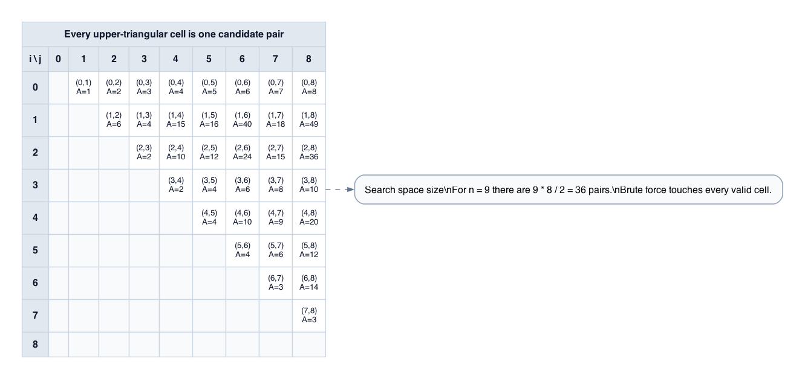
</div>

The real problem is not "how do I compute an area?" but "how do I avoid evaluating almost all of these cells?"

### 3. First Evaluation: Start at the Maximum Width
Shows the very first check at `(0, 8)`, the widest possible container. Starting here guarantees that if one side is the bottleneck, every inner pair anchored at that side is immediately under suspicion.

<div align="center">
  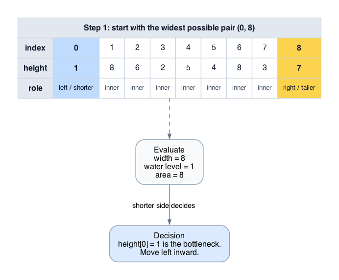
</div>

The first area is only `8`, but the key information is structural: the left height is just `1`, so it is the limiting wall.

### 4. Pruning a Row: Why `(0, k)` Can All Be Deleted
Zooms into the search-space consequence of evaluating `(0, 8)`. Once we know `height[0]` is the bottleneck, the entire row anchored at index `0` can be discarded.

<div align="center">
  
</div>

Every `(0, k)` has smaller width than `(0, 8)`, and its water level still cannot exceed `1`. That is the core pruning move of the algorithm.

### 5. Best Pair Discovery: Where the Maximum Comes From
Shows the next state `(1, 8)` where the maximum area `49` is found. This is the canonical example of why moving the short wall can unlock a much better bottleneck.

<div align="center">
  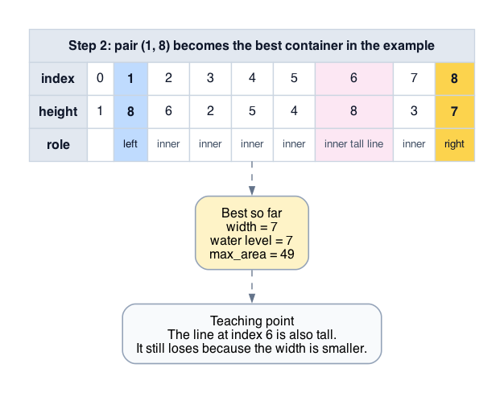
</div>

The tall inner line at index `6` looks tempting, but width matters just as much as height. A slightly taller inner partner can still lose because it comes with a smaller distance.

### 6. Pruning a Column: The Symmetric Argument
Now the right wall at index `8` is shorter than the left wall at index `1`. The same proof works in reverse, so the entire column anchored at `8` can be eliminated.

<div align="center">
  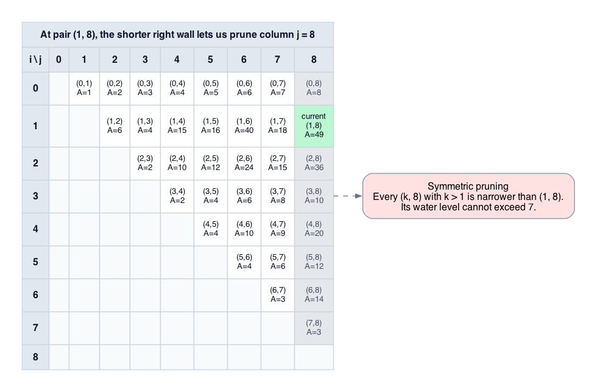
</div>

The algorithm is not biased toward left moves. It always deletes the side whose height caps the current container.

### 7. Tie Case: Equal Heights Let You Move Either Pointer
Shows the state `(1, 6)` where both heights are `8`. This is the only branch where the proof does not prefer a side, because both sides impose the same bottleneck.

<div align="center">
  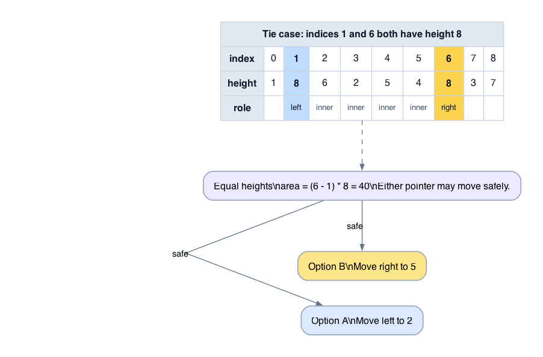
</div>

Moving either pointer is safe. The width must decrease, and keeping just one of the equal walls cannot make the bounding height better than the one we already used.

### 8. One Path Through the Matrix: Why Time Is Linear
Marks the actual cells visited on the sample input. Instead of touching every valid pair, the algorithm walks one monotone path from the top-right corner toward the diagonal.

<div align="center">
  
</div>

Each iteration deletes one full row or one full column from consideration. That is why the algorithm examines only $O(n)$ pairs even though the original state space is $O(n^2)$.

### 9. Main Invariant: The Answer Is Never Lost
Combines already-pruned regions, the currently active search window, and the best pair already recorded. This is the picture behind the correctness proof.

<div align="center">
  
</div>

At every step, either the true optimum has already been recorded, or it still lies inside the current pointer bounds. The pruning proof exists to keep that statement true.

### 10. Wrong Move Failure: Moving the Taller Wall Is Useless
Contrasts the correct move with the tempting but wrong one. If you keep the shorter wall and move the taller one inward, width shrinks while the bottleneck does not improve.

<div align="center">
  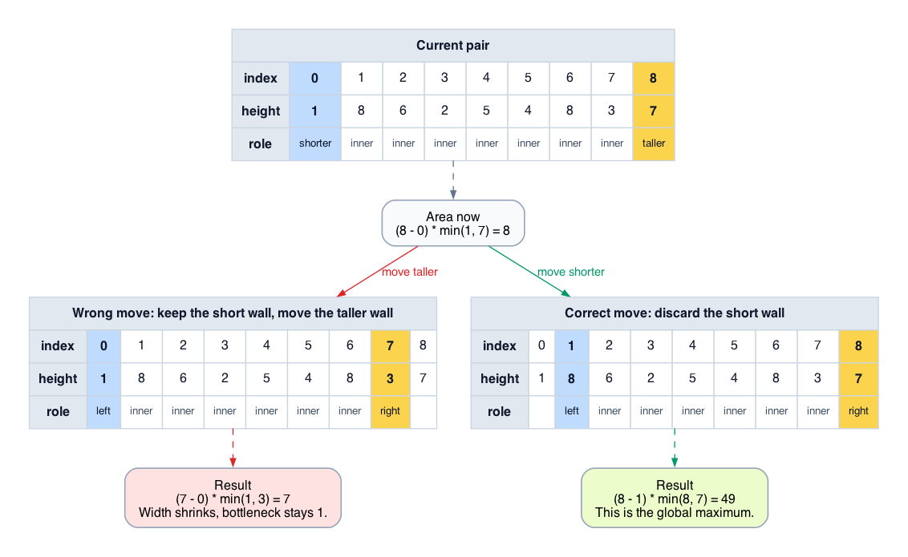
</div>

This is the easiest way to explain the algorithm in an interview: the taller wall is not the problem, so moving it does not address the constraint limiting the area.

### 11. Decision Rule Summary: Compare, Then Move the Bottleneck
Provides a compact flowchart for the pointer update rule. This is the "operational memory" version of the proof.

<div align="center">
  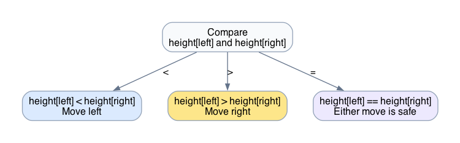
</div>

If the left wall is shorter, move left. If the right wall is shorter, move right. If they are equal, either move is safe.

### 12. Edge Case: Only Two Lines
Shows the smallest legal input. There is only one container to evaluate, so the loop runs once and stops.

<div align="center">
  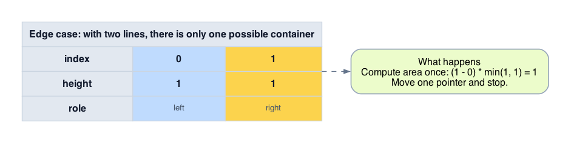
</div>

This is useful for sanity-checking the loop guard: `left < right` evaluates exactly the one available pair and then terminates cleanly.

### 13. Edge Case: Zero-Height Boundary
Shows that a wide container can still hold zero water if one chosen wall has height `0`. This prevents width-only intuition from taking over.

<div align="center">
  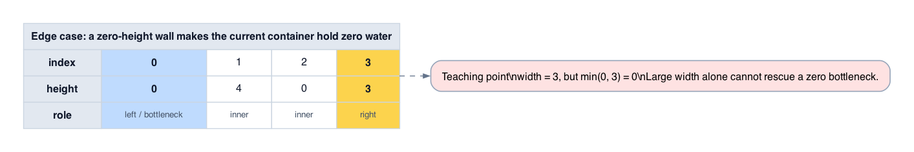
</div>

The area formula is always width times the minimum height. If the minimum is `0`, the entire container is worthless no matter how wide it is.

### 14. Remaining Example Steps: The Right Pointer Keeps Shrinking
Traces the later right-pointer moves after the best pair is found. This reinforces that a later pair can still be worth checking even if the current best is already large.

<div align="center">
  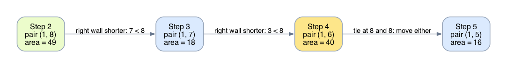
</div>

The algorithm does not stop early when it finds a strong candidate. It keeps pruning until the pointers meet, because only the proof tells us which remaining cells are impossible.

### 15. Work Comparison: Brute Force vs. Two Pointers
Ends with a direct comparison between the exhaustive search and the pruned search on this example. The point is to connect the visual pruning story back to complexity.

<div align="center">
  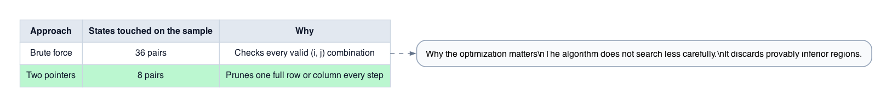
</div>

The two-pointer method is not lucky. It is fast because each move deletes a provably losing region of the search space instead of merely hoping a local greedy choice works.

### 16. Width vs. Height Tradeoff: Taller Does Not Automatically Mean Better
Compares the optimal pair `(1, 8)` with the tempting inner pair `(1, 6)`. This is the cleanest picture for readers who over-focus on tall bars and underweight width.

<div align="center">
  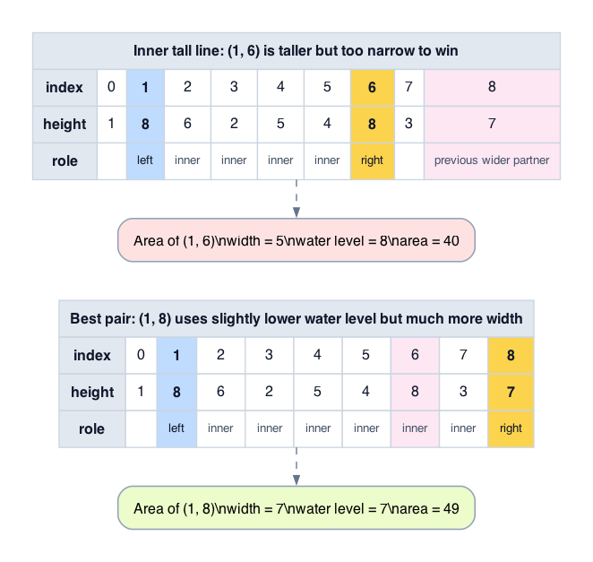
</div>

The inner pair has a higher water level, but it loses too much width. The area objective multiplies both factors, so a slightly lower water level can still win decisively.

### 17. Tie Optimization: Why Moving Both Pointers Is Also Safe
Builds on the equal-height case and shows the stronger statement: when both boundary heights are equal, you may move both pointers inward at once without losing the optimum.

<div align="center">
  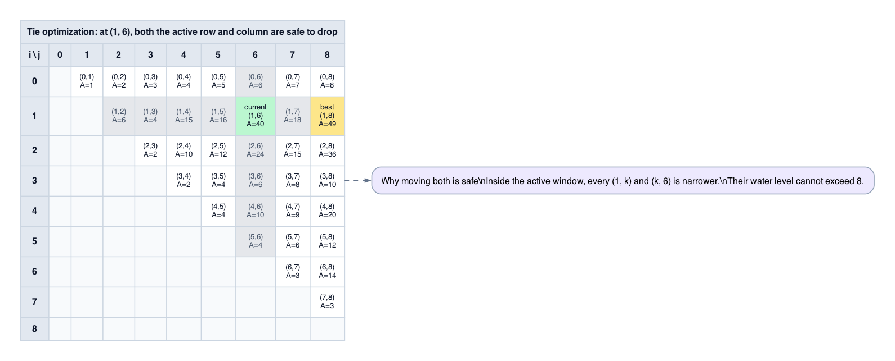
</div>

Inside the active window, every candidate anchored at either equal-height wall is narrower and cannot beat the current water level. That is why the optional “move both on tie” optimization is sound.

### 18. Convergence and Termination: Width Falls by Exactly One Each Step
Shows the active pair sequence for the sample input all the way until the pointers meet. This turns the loop termination argument into a visual invariant.

<div align="center">
  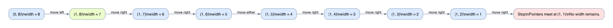
</div>

Each iteration moves exactly one pointer inward, so `right - left` shrinks by exactly `1`. Once the width reaches `0`, there are no valid pairs left to evaluate and the loop must stop.

# Complexity Analysis
1. **Define the input size:** Let $n$ be the length of the `height` array.
2. **Count the work per iteration:** Inside the while loop, we perform $O(1)$ operations: a subtraction, a `min()` comparison, a multiplication, a `max()` assignment, and a single pointer increment/decrement.
3. **Bound the iterations:** The `left` pointer starts at 0, the `right` pointer starts at $n-1$. At exactly every iteration, the distance between them (`right - left`) decreases by exactly 1. 
4. **State the case:** The loop terminates when `left == right`, which means exactly $n - 1$ iterations occur, across best, worst, and average cases.
5. **Conclude:** The time complexity is $(n - 1) \times O(1) = O(n)$.
6. **Space:** We only allocate three integers (`left`, `right`, `max_area`). There are no auxiliary arrays or recursive call stacks. The space complexity is $O(1)$.

**Compressed Restatement:**
The variables converge linearly, performing exactly $n-1$ constant-time iterations. The algorithm requires $O(n)$ time and $O(1)$ space.

# What Breaks If...
- **What if we moved the taller pointer instead of the shorter one?**
  - **Change:** `if height[left] > height[right]: left += 1`
  - **What breaks:** The pruning invariant is completely destroyed. By dropping the taller line, you are forcing the bounding height to remain capped by the shorter line, while simultaneously shrinking the width. The area is mathematically doomed to decrease. You will silently skip pairs that relied on the taller line, missing the global maximum.
  - **What you would need:** A completely different logic. This approach is irrecoverable.
- **What if the heights could be negative?**
  - **Change:** $height[i] < 0$
  - **What breaks:** The physical meaning of the container breaks depending on how water is held. If water cannot fall below the x-axis, the minimum bounding height logic still fundamentally works but would clip at 0.
- **What if we moved both pointers when their heights were equal?**
  - **Change:** `if H[left] == H[right]: left += 1; right -= 1`
  - **What breaks:** Nothing breaks! This is perfectly safe (and explicitly skips an unnecessary check). If both lines are identical in height, keeping one but moving the other inward guarantees a smaller width with identical-or-worse bounding height. Thus, both can be safely discarded at once.

# Edge Cases & Pitfalls
- **Case:** Only two elements in the array (e.g. `[1, 1]`)
  - **Why it matters:** It is the absolute smallest valid input ($n=2$).
  - **What the algorithm does:** Computes the area of `(0, 1)`, drops one pointer, loop terminates instantly.
  - **Common implementation bug:** Initializing `max_area = -infinity`. While safe here since heights are positive, initializing to `0` is mathematically safer for purely positive volume constraints.

# Transferable Pattern Recognition
- **Core pattern:** 2D Search Space Pruning for extremum pairs.
- **Recognition triggers:** You need to maximize a function over pairs, and the function depends on the index distance multiplied by a bottleneck value.
- **Why this problem fits:** Area = distance × bottleneck. 
- **Sister problems:** 
  - *Two Sum (Sorted array):* Also uses two pointers starting from ends, pruning the search space when the sum is too large or too small.
  - *Trapping Rain Water:* While distinct (asks for total accumulation rather than a single max pair), it relies on the same "water level is bounded by the smallest maximal boundary" logic.

# Problem Variations & Follow-Ups
- **Variation:** Return the *indices* of the maximum container, not just the area.
  - **What changes:** Add variables `best_left` and `best_right`. Update them inside the block where `max_area` is updated.
  - **What stays the same:** The entire pruning invariant and complexity.
- **Variation:** The x-axis distance between bars varies (bars are at given x-coordinates rather than implicit indices).
  - **What changes:** Instead of `right - left`, width is `x_coords[right] - x_coords[left]`. The pruning logic remains identical because dropping the shorter line still securely discards pairs with strictly narrower `x` distance and equal-or-worse height.

# Interview Questions

## Clarifying Questions I Should Ask
- "Are we guaranteed that the lines do not displace any water internally?"
- "Can height be zero? (Yes)"

## In-Problem Follow-Ups
- "Why did you use `>=` instead of handling the `==` case explicitly?"
- "Could a greedy approach of just sorting the array first and checking only the tallest lines work?" (No, because sorting destroys the index distances, which dictate the width multiplier).

## Post-Solution Probes
- "If the problem asked for the *minimum* water container, how would this two-pointer approach fare?" 
  - (Answer: It would fail. Our pruning guarantees we don't discard the *maximum*. To find the minimum, dropping the shorter line doesn't safely prune minimums. However, the minimum container is trivially adjacent lines or zero-height lines).

# Self-Test Questions
1. Why does moving the taller line mathematically guarantee an inferior area?
2. If `height[left] == height[right]`, does it matter which pointer we move? Why?
3. What is the precise definition of the search space $S$?
4. Write out the 3-line loop guard and branching transition without looking at the notes.

# Next Step Before Coding
Draw an array of 5 elements mentally. Identify the absolute highest and lowest elements. Point your fingers at the extreme ends, calculate the imaginary area, and physically move the finger pointing to the smaller value. Once the pruning logic clicks as completely risk-free, write the `while` loop on a blank editor.
