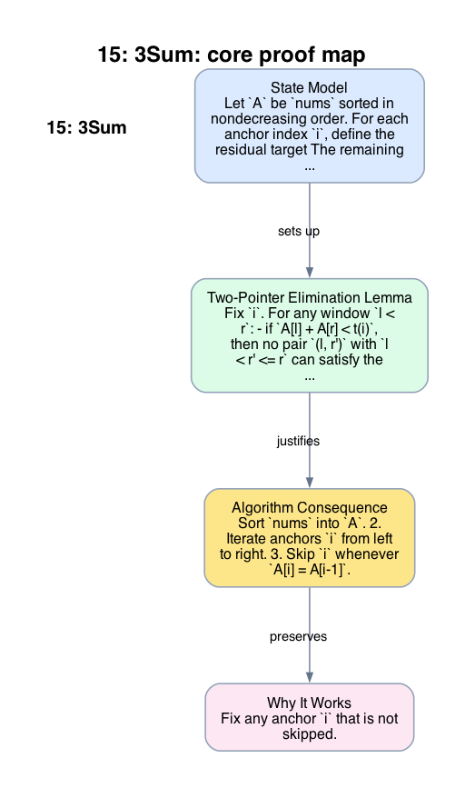

# 15: 3Sum

- **Difficulty:** Medium
- **Tags:** Array, Sorting, Two Pointers
- **Pattern:** Sorted search with deduplication

## Fundamentals

### Problem Contract
Given an integer array `nums`, return every value-triple `(a, b, c)` such that:
- the triple uses three distinct indices,
- `a + b + c = 0`,
- and no value-triple appears more than once in the output.

The contract depends on value uniqueness, not index uniqueness in the output. Two triples with the same sorted values are duplicates even if they come from different indices.

### Definitions and State Model
Let `A` be `nums` sorted in nondecreasing order. For each anchor index `i`, define the residual target
```text
t(i) = -A[i].
```
The remaining task is to find pairs `(l, r)` with `i < l < r < n` and
```text
A[l] + A[r] = t(i).
```
Sorting is useful because, for fixed `i`, increasing `l` increases the pair sum and decreasing `r` decreases the pair sum.

### Key Lemma / Invariant / Recurrence
#### Two-Pointer Elimination Lemma
Fix `i`. For any window `l < r`:
- if `A[l] + A[r] < t(i)`, then no pair `(l, r')` with `l < r' <= r` can satisfy the target, so incrementing `l` is safe;
- if `A[l] + A[r] > t(i)`, then no pair `(l', r)` with `l <= l' < r` can satisfy the target, so decrementing `r` is safe.

The proof is monotonicity: in sorted order, replacing `r` by a smaller index cannot increase the sum, and replacing `l` by a larger index cannot decrease the sum.

#### Deduplication Invariant
When `A[i] = A[i-1]`, anchor `i` would generate exactly the same value-triples as anchor `i-1`, so it must be skipped. After recording one triple, advancing `l` past all copies of `A[l]` and retreating `r` past all copies of `A[r]` prevents duplicate output for that anchor.

### Algorithm
1. Sort `nums` into `A`.
2. Iterate anchors `i` from left to right.
3. Skip `i` whenever `A[i] = A[i-1]`.
4. Set `l = i + 1` and `r = n - 1`.
5. Compare `A[l] + A[r]` with `-A[i]` and move the pointer justified by the elimination lemma.
6. When equality holds, record `(A[i], A[l], A[r])` and skip duplicates on both sides.

```text
sort(A)
ans = []
for i in 0 .. n-3:
    if i > 0 and A[i] == A[i-1]:
        continue
    l = i + 1
    r = n - 1
    while l < r:
        s = A[i] + A[l] + A[r]
        if s < 0:
            l += 1
        elif s > 0:
            r -= 1
        else:
            append (A[i], A[l], A[r]) to ans
            l += 1
            r -= 1
            while l < r and A[l] == A[l-1]:
                l += 1
            while l < r and A[r] == A[r+1]:
                r -= 1
return ans
```

### Correctness Proof
Fix any anchor `i` that is not skipped. The inner loop starts with the full feasible pair range `i+1 .. n-1`. By the two-pointer elimination lemma, each pointer move discards only pairs whose sums are provably too small or too large to complete `A[i]` to zero. Therefore every pair that could yield a valid triple remains in the search window until it is either found or ruled out.

When the loop reaches equality, the algorithm outputs `(A[i], A[l], A[r])`, which is valid because its sum is zero. The duplicate-skipping step removes only pairs with the same endpoint values, so it cannot delete a distinct value-triple. Conversely, any duplicate value-triple would require the same sorted values at the anchor or at one of the pair endpoints, and the deduplication invariant skips exactly those repetitions.

Now take any valid value-triple in sorted order. Its first value appears at some leftmost anchor `i` that is not skipped. During the inner search for that `i`, the elimination lemma prevents the corresponding pair from being discarded before it is reached, so the algorithm outputs the triple. Thus every valid value-triple is produced exactly once.

### Complexity Analysis
Let `n = len(nums)`.

- Sorting costs `O(n log n)`.
- The outer loop runs `n` times.
- For each anchor, the two pointers move inward monotonically, so the inner loop does `O(n)` total pointer moves for that anchor.

Therefore the total time is `O(n^2)`, which dominates the sort. The extra space is `O(1)` beyond the output if the sort is treated as in-place, or `O(log n)` stack space for a comparison sort implementation.

## Appendix

### Visuals

#### 1. Core Proof Map
This image is the required appendix visual for the note.

<div align="center">
  
</div>

This diagram compresses the state model, key claim, and algorithm consequence into one view so the proof spine is easier to reconstruct from memory.

### Common Pitfalls
- Skipping duplicate anchors after the inner loop is too late; duplicate suppression must happen before the inner search starts.
- After finding a valid triple, moving only one pointer can emit the same value-triple again.
