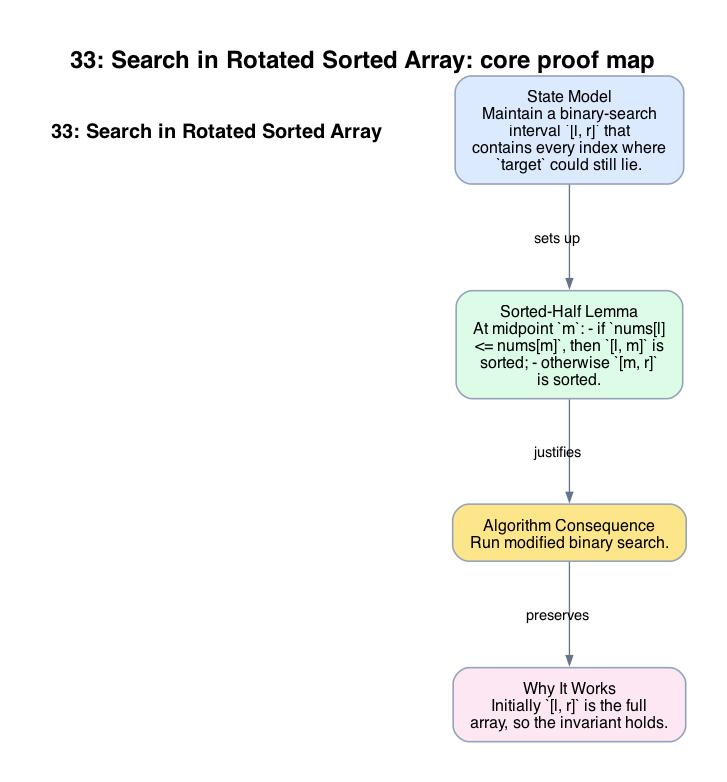

# 33: Search in Rotated Sorted Array

- **Difficulty:** Medium
- **Tags:** Array, Binary Search
- **Pattern:** Binary search with sorted-half detection

## Fundamentals

### Problem Contract
`nums` is obtained by rotating a strictly increasing array at an unknown pivot. All values are distinct. Return the index of `target`, or `-1` if absent.

### Definitions and State Model
Maintain a binary-search interval `[l, r]` that contains every index where `target` could still lie.

For any midpoint `m`, at least one of the halves `[l, m]` or `[m, r]` is sorted in increasing order because the array is a rotated version of a strictly increasing array with distinct values.

### Key Lemma / Invariant / Recurrence
#### Sorted-Half Lemma
At midpoint `m`:
- if `nums[l] <= nums[m]`, then `[l, m]` is sorted;
- otherwise `[m, r]` is sorted.

#### Elimination Rule
If the sorted half contains `target` by value range, keep that half; otherwise discard it. Distinctness guarantees the range test is unambiguous.

### Algorithm
Run modified binary search.

```text
l = 0
r = n - 1
while l <= r:
    m = (l + r) // 2
    if nums[m] == target:
        return m
    if nums[l] <= nums[m]:
        if nums[l] <= target < nums[m]:
            r = m - 1
        else:
            l = m + 1
    else:
        if nums[m] < target <= nums[r]:
            l = m + 1
        else:
            r = m - 1
return -1
```

### Correctness Proof
Initially `[l, r]` is the full array, so the invariant holds.

Assume it holds at the start of an iteration. If `nums[m] = target`, returning `m` is correct. Otherwise the sorted-half lemma identifies one half that is fully ordered. If `target` lies inside that half's value range, it must lie there by sortedness, so discarding the other half preserves the invariant. If `target` lies outside that value range, it cannot be in the sorted half, so discarding the sorted half preserves the invariant instead.

Each update shrinks the interval. When the loop ends, the invariant says no candidate index remains, so returning `-1` is correct. Therefore the algorithm returns the index of `target` exactly when `target` is present.

### Complexity Analysis
Let `n = len(nums)`.

- Each iteration does `O(1)` work.
- Each iteration discards half of the remaining interval.

The running time is `O(log n)` and the auxiliary space is `O(1)`.

## Appendix

### Visuals

#### 1. Core Proof Map
This image is the required appendix visual for the note.

<div align="center">
  
</div>

This diagram compresses the state model, key claim, and algorithm consequence into one view so the proof spine is easier to reconstruct from memory.

### Common Pitfalls
- This proof relies on distinct values. With duplicates, the sorted-half test can become ambiguous and requires a different argument.
- Comparing `target` only against `nums[m]` misses the rotated ordering information carried by `nums[l]` and `nums[r]`.
