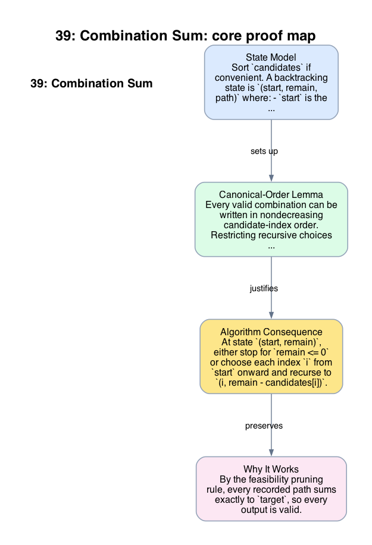

# 39: Combination Sum

- **Difficulty:** Medium
- **Tags:** Array, Backtracking
- **Pattern:** Search tree with nondecreasing choice index

## Fundamentals

### Problem Contract
Given distinct positive integers `candidates` and a positive integer `target`, return all unique combinations whose values sum to `target`. Each candidate may be used unlimited times.

The output is unique up to multiset equality; order inside a combination does not matter.

### Definitions and State Model
Sort `candidates` if convenient. A backtracking state is `(start, remain, path)` where:
- `start` is the minimum index allowed for the next choice,
- `remain` is the remaining sum to realize,
- `path` is the multiset chosen so far in nondecreasing index order.

### Key Lemma / Invariant / Recurrence
#### Canonical-Order Lemma
Every valid combination can be written in nondecreasing candidate-index order. Restricting recursive choices to indices `>= start` therefore preserves completeness while removing permutation duplicates.

#### Feasibility Pruning Rule
Because all candidates are positive, once `remain < 0` the branch cannot recover. When `remain = 0`, the current path is exactly one valid combination.

### Algorithm
At state `(start, remain)`, either stop for `remain <= 0` or choose each index `i` from `start` onward and recurse to `(i, remain - candidates[i])`.

```text
ans = []

dfs(start, remain, path):
    if remain == 0:
        append copy(path) to ans
        return
    if remain < 0:
        return
    for i in start .. n-1:
        path.push(candidates[i])
        dfs(i, remain - candidates[i], path)
        path.pop()

dfs(0, target, [])
return ans
```

### Correctness Proof
By the feasibility pruning rule, every recorded path sums exactly to `target`, so every output is valid.

Now take any valid combination. Sorting its chosen candidate indices yields a nondecreasing sequence. By the canonical-order lemma, the DFS can realize that sequence by repeatedly choosing the same index or a larger one, because recursion never decreases `start`. Therefore every valid combination appears in the search tree.

Permutation duplicates do not appear because the DFS never explores two different orderings of the same multiset: once an index is skipped, recursion cannot return to a smaller index later. Thus the algorithm outputs every valid combination exactly once.

### Complexity Analysis
Let `n` be the number of candidates. The output size is exponential in the worst case, so the search tree can also be exponential.

- Each recursive edge does `O(1)` local work plus the cost of copying a successful path.
- The maximum recursion depth is at most `target / min(candidates)`.

Therefore the worst-case running time is exponential in the size of the search space, and the auxiliary space is `O(depth)` for recursion plus output storage.

## Appendix

### Visuals

#### 1. Core Proof Map
This image is the required appendix visual for the note.

<div align="center">
  
</div>

This diagram compresses the state model, key claim, and algorithm consequence into one view so the proof spine is easier to reconstruct from memory.

### Common Pitfalls
- Advancing to `i + 1` after choosing `candidates[i]` incorrectly forbids reuse of the same candidate.
- Allowing recursive calls to choose smaller indices reintroduces permutation duplicates.
