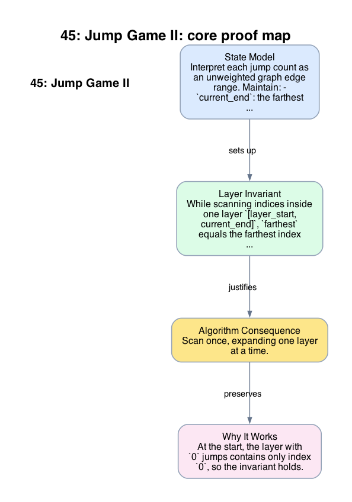

# 45: Jump Game II

- **Difficulty:** Medium
- **Tags:** Array, Greedy
- **Pattern:** Layered greedy expansion

## Fundamentals

### Problem Contract
Given nonnegative jump lengths `nums[0..n-1]`, start at index `0` and return the minimum number of jumps needed to reach index `n-1`. It is guaranteed that the end is reachable.

### Definitions and State Model
Interpret each jump count as an unweighted graph edge range. Maintain:
- `current_end`: the farthest index reachable using the current number of jumps,
- `farthest`: the farthest index reachable using one additional jump from the current layer,
- `jumps`: the number of completed layers.

### Key Lemma / Invariant / Recurrence
#### Layer Invariant
While scanning indices inside one layer `[layer_start, current_end]`, `farthest` equals the farthest index reachable with one more jump from any index in that layer.

#### Greedy Layer Lemma
When the scan reaches `current_end`, one more jump is necessary, and jumping to the layer ending at `farthest` is optimal. This is exactly the BFS layer transition for an unweighted graph.

### Algorithm
Scan once, expanding one layer at a time.

```text
jumps = 0
current_end = 0
farthest = 0
for i in 0 .. n-2:
    farthest = max(farthest, i + nums[i])
    if i == current_end:
        jumps += 1
        current_end = farthest
return jumps
```

### Correctness Proof
At the start, the layer with `0` jumps contains only index `0`, so the invariant holds.

While scanning a layer, every index in that layer is reachable using exactly `jumps` jumps. Updating `farthest` with `i + nums[i]` therefore computes the farthest index reachable in `jumps + 1` jumps from any node in the current layer. When the scan reaches `current_end`, every index reachable in `jumps` jumps has been considered. Any path to a later index must use at least one more jump, so incrementing `jumps` is necessary. Setting `current_end = farthest` makes the next layer exactly the set of indices reachable in `jumps` jumps.

By induction over layers, the first time the scan covers the last index, `jumps` is the minimum number of jumps needed.

### Complexity Analysis
Let `n = len(nums)`.

- The loop visits each index once.
- Each iteration performs `O(1)` work.

The running time is `O(n)` and the auxiliary space is `O(1)`.

## Appendix

### Visuals

#### 1. Core Proof Map
This image is the required appendix visual for the note.

<div align="center">
  
</div>

This diagram compresses the state model, key claim, and algorithm consequence into one view so the proof spine is easier to reconstruct from memory.

### Common Pitfalls
- Incrementing `jumps` on every improvement to `farthest` overcounts; the jump count changes only when the current layer is exhausted.
- This is not the same objective as Jump Game I, which asks only for feasibility.
