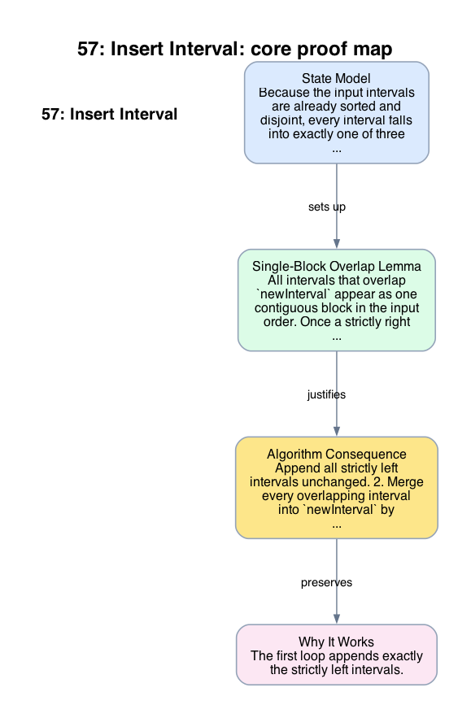

# 57: Insert Interval

- **Difficulty:** Medium
- **Tags:** Array
- **Pattern:** Ordered interval splice and merge

## Fundamentals

### Problem Contract
`intervals` is sorted by start time and pairwise non-overlapping. Insert `newInterval` into the list and return the resulting sorted, pairwise non-overlapping list.

### Definitions and State Model
Because the input intervals are already sorted and disjoint, every interval falls into exactly one of three categories relative to `newInterval`:
- strictly left: `interval.end < new.start`,
- overlapping: `interval.start <= new.end` and `interval.end >= new.start`,
- strictly right: `interval.start > new.end`.

### Key Lemma / Invariant / Recurrence
#### Single-Block Overlap Lemma
All intervals that overlap `newInterval` appear as one contiguous block in the input order. Once a strictly right interval appears, no later interval can overlap `newInterval` because starts are nondecreasing.

### Algorithm
1. Append all strictly left intervals unchanged.
2. Merge every overlapping interval into `newInterval` by expanding its boundaries.
3. Append the merged `newInterval`.
4. Append the remaining strictly right intervals unchanged.

```text
ans = []
i = 0
while i < n and intervals[i].end < new.start:
    ans.append(intervals[i])
    i += 1
while i < n and intervals[i].start <= new.end:
    new.start = min(new.start, intervals[i].start)
    new.end = max(new.end, intervals[i].end)
    i += 1
ans.append(new)
while i < n:
    ans.append(intervals[i])
    i += 1
return ans
```

### Correctness Proof
The first loop appends exactly the strictly left intervals. They cannot overlap `newInterval`, and because the input is sorted and disjoint, they remain correct in the output.

By the single-block overlap lemma, the second loop visits exactly the overlapping block. Replacing that whole block together with the original `newInterval` by the interval spanning their minimum start and maximum end preserves the union of those intervals and keeps the result disjoint from the already appended left part.

Once the second loop ends, all remaining intervals are strictly right and therefore cannot overlap the merged interval. Appending them unchanged preserves sorted order and disjointness. Thus the output is exactly the inserted-and-merged interval list required by the contract.

### Complexity Analysis
Let `n` be the number of intervals.

- Each interval is scanned once.
- Each append or merge update is `O(1)`.

The running time is `O(n)`. The auxiliary space is `O(n)` for the output list.

## Appendix

### Visuals

#### 1. Core Proof Map
This image is the required appendix visual for the note.

<div align="center">
  
</div>

This diagram compresses the state model, key claim, and algorithm consequence into one view so the proof spine is easier to reconstruct from memory.

### Common Pitfalls
- Re-sorting the whole list is unnecessary because the input order already gives the needed structure.
- Stopping after the first overlap is incorrect; `newInterval` can keep expanding and absorb more intervals to the right.
