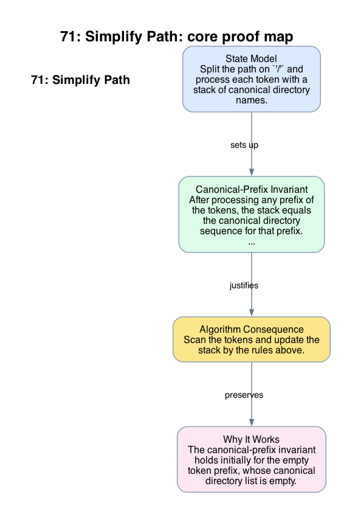

# 71: Simplify Path

- **Difficulty:** Medium
- **Tags:** String, Stack
- **Pattern:** Canonical path reduction

## Fundamentals

### Problem Contract
Given an absolute Unix-style path, return its canonical form.

Canonicalization rules:
- repeated `'/'` behaves like one separator,
- `'.'` means the current directory and contributes nothing,
- `'..'` moves to the parent directory if one exists,
- ordinary names push one directory level.

### Definitions and State Model
Split the path on `'/'` and process each token with a stack of canonical directory names.

The stack represents the path components of the canonical prefix built so far.

### Key Lemma / Invariant / Recurrence
#### Canonical-Prefix Invariant
After processing any prefix of the tokens, the stack equals the canonical directory sequence for that prefix.

Token handling is complete:
- empty token or `'.'`: no effect,
- `'..'`: pop one component if possible,
- ordinary name: push it.

### Algorithm
Scan the tokens and update the stack by the rules above.

```text
stack = []
for token in path.split('/'):
    if token == '' or token == '.':
        continue
    if token == '..':
        if stack:
            stack.pop()
    else:
        stack.append(token)
return '/' + '/'.join(stack)
```

### Correctness Proof
The canonical-prefix invariant holds initially for the empty token prefix, whose canonical directory list is empty.

Assume it holds before processing one token. Ignoring empty tokens and `'.'` is correct by the path semantics. If the token is `'..'`, removing the most recent stack element exactly models moving to the parent directory, unless already at root, in which case root is unchanged. If the token is an ordinary name, appending it extends the canonical path by one level. Thus the invariant is preserved.

After all tokens are processed, the stack is the canonical directory sequence for the whole path, and joining it with leading `'/'` returns the canonical absolute path.

### Complexity Analysis
Let `n` be the length of the input path.

- Splitting and scanning the tokens is `O(n)`.
- Each token causes at most one stack push or pop.

The running time is `O(n)`, and the auxiliary space is `O(n)` in the worst case for the stack and output.

## Appendix

### Visuals

#### 1. Core Proof Map
This image is the required appendix visual for the note.

<div align="center">
  
</div>

This diagram compresses the state model, key claim, and algorithm consequence into one view so the proof spine is easier to reconstruct from memory.

### Common Pitfalls
- Appending `'..'` as a literal directory name is incorrect; it is a control token, not a normal component.
- The result for an empty stack must be `'/'`, not the empty string.
