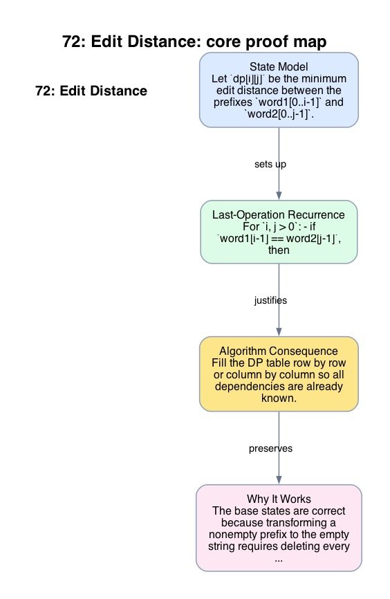

# 72: Edit Distance

- **Difficulty:** Medium
- **Tags:** String, Dynamic Programming
- **Pattern:** 2D alignment DP

## Fundamentals

### Problem Contract
Given strings `word1` and `word2`, return the minimum number of single-character operations needed to transform `word1` into `word2`, where the allowed operations are insertion, deletion, and replacement.

### Definitions and State Model
Let `dp[i][j]` be the minimum edit distance between the prefixes `word1[0..i-1]` and `word2[0..j-1]`.

Base states:
```text
dp[i][0] = i,
dp[0][j] = j.
```
They correspond to deleting all `i` characters or inserting all `j` characters.

### Key Lemma / Invariant / Recurrence
#### Last-Operation Recurrence
For `i, j > 0`:
- if `word1[i-1] == word2[j-1]`, then
```text
dp[i][j] = dp[i-1][j-1].
```
- otherwise,
```text
dp[i][j] = 1 + min(
    dp[i-1][j],   # delete word1[i-1]
    dp[i][j-1],   # insert word2[j-1]
    dp[i-1][j-1]  # replace word1[i-1]
).
```
The recurrence is exhaustive because every optimal edit script ends with exactly one of these possibilities.

### Algorithm
Fill the DP table row by row or column by column so all dependencies are already known.

```text
m = len(word1)
n = len(word2)
initialize dp of size (m+1) x (n+1)
set base row and base column
for i in 1 .. m:
    for j in 1 .. n:
        if word1[i-1] == word2[j-1]:
            dp[i][j] = dp[i-1][j-1]
        else:
            dp[i][j] = 1 + min(dp[i-1][j], dp[i][j-1], dp[i-1][j-1])
return dp[m][n]
```

### Correctness Proof
The base states are correct because transforming a nonempty prefix to the empty string requires deleting every character, and transforming the empty string to a nonempty prefix requires inserting every character.

Now fix `i, j > 0` and assume all smaller subproblems are correct. If the final characters already match, no edit is needed on them, so the problem reduces to the prefixes of length `i-1` and `j-1`. Otherwise any optimal script must end by deleting `word1[i-1]`, inserting `word2[j-1]`, or replacing `word1[i-1]` by `word2[j-1]`. The last-operation recurrence therefore takes the minimum over exactly the three possible optimal final steps. By induction, `dp[i][j]` is correct.

Thus `dp[m][n]` equals the true edit distance.

### Complexity Analysis
Let `m = len(word1)` and `n = len(word2)`.

- The table has `(m+1)(n+1)` states.
- Each state is computed in `O(1)` time from three neighbors.

The running time is `O(mn)`, and the auxiliary space is `O(mn)` for the full table. A rolling-row optimization can reduce the auxiliary space to `O(n)`.

## Appendix

### Visuals

#### 1. Core Proof Map
This image is the required appendix visual for the note.

<div align="center">
  
</div>

This diagram compresses the state model, key claim, and algorithm consequence into one view so the proof spine is easier to reconstruct from memory.

### Common Pitfalls
- Matching characters must use `dp[i-1][j-1]` directly; adding `1` in the equal-character case overcounts.
- Longest common subsequence is related but not equivalent; edit distance also charges insertions and deletions outside the shared subsequence.
