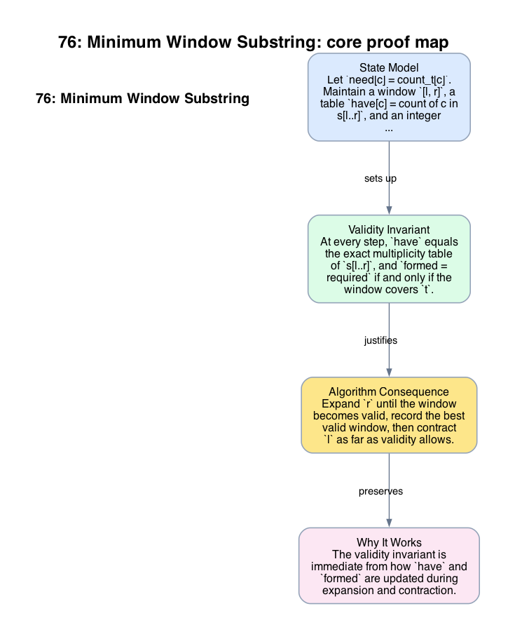

# 76: Minimum Window Substring

- **Difficulty:** Hard
- **Tags:** Hash Table, String, Sliding Window
- **Pattern:** Variable window with multiplicity constraints

## Fundamentals

### Problem Contract
Given strings `s` and `t`, return the shortest contiguous substring of `s` whose character multiplicities cover all multiplicities in `t`. If no such substring exists, return the empty string.

Coverage means:
```text
count_window[c] >= count_t[c] for every character c in t.
```

### Definitions and State Model
Let `need[c] = count_t[c]`. Maintain a window `[l, r]`, a table `have[c] = count of c in s[l..r]`, and an integer `formed` equal to the number of characters `c` for which `have[c] = need[c]`.

Let `required = number of distinct characters in t`. The window is valid exactly when `formed = required`.

### Key Lemma / Invariant / Recurrence
#### Validity Invariant
At every step, `have` equals the exact multiplicity table of `s[l..r]`, and `formed = required` if and only if the window covers `t`.

#### Left-Minimization Lemma
Fix a right boundary `r`. Once `[l, r]` is valid, repeatedly incrementing `l` while preserving validity yields the unique smallest valid window ending at `r`.

The reason is monotonicity: deleting more characters from the left can only decrease multiplicities, so validity switches from true to false at most once as `l` moves right.

### Algorithm
Expand `r` until the window becomes valid, record the best valid window, then contract `l` as far as validity allows.

```text
need = counts of t
have = empty counts
required = number of keys in need
formed = 0
l = 0
best = no window

for r in 0 .. len(s)-1:
    add s[r] to have
    if have[s[r]] == need[s[r]]:
        formed += 1
    while formed == required:
        update best with [l, r]
        remove s[l] from have
        if have[s[l]] == need[s[l]] - 1:
            formed -= 1
        l += 1
return best substring or ""
```

### Correctness Proof
The validity invariant is immediate from how `have` and `formed` are updated during expansion and contraction.

Take any iteration with fixed right boundary `r`. If the window is invalid, no substring ending at `r` with the same left boundary can be an answer. When the window becomes valid, the left-minimization lemma shows that the contraction loop reaches the smallest valid window ending at `r` before invalidity occurs. Therefore, when the algorithm records `best`, it compares against the minimum valid candidate for that `r`.

Now consider any globally minimum valid window `W`. When the scan reaches its right boundary, the algorithm will eventually make the window valid and then contract left until it reaches the smallest valid window ending there, whose length is at most `|W|`. Hence the global optimum is recorded. Conversely, every recorded candidate is valid by the invariant. Therefore the returned substring is exactly the shortest valid window.

### Complexity Analysis
Let `m = len(s)` and `n = len(t)`.

- Building `need` costs `O(n)`.
- Each index of `s` enters the window once and leaves the window once.
- Table updates are `O(1)` on average.

So the average-case running time is `O(m + n)`, and the auxiliary space is `O(|Sigma_t|)`, the number of distinct characters tracked from `t` and the active window.

## Appendix

### Visuals

#### 1. Core Proof Map
This image is the required appendix visual for the note.

<div align="center">
  
</div>

This diagram compresses the state model, key claim, and algorithm consequence into one view so the proof spine is easier to reconstruct from memory.

### Common Pitfalls
- Tracking only set membership instead of multiplicity fails when `t` contains duplicates.
- Updating the answer before the window is fully valid records substrings that do not cover `t`.
