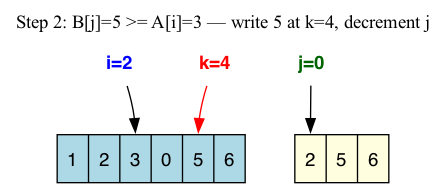
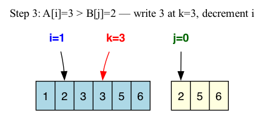
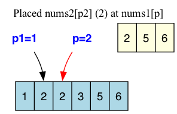
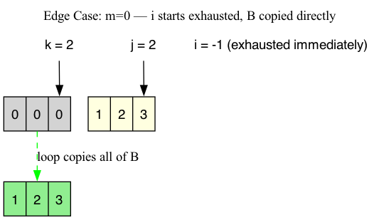
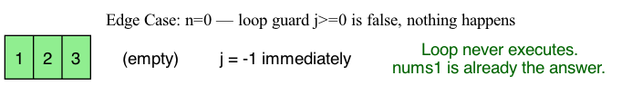

# 088: Merge Sorted Array

# Problem Metadata
- **LeetCode Number:** 88
- **Difficulty:** Easy
- **Topic Tags:** Array, Two Pointers
- **Primary Pattern:** Two Pointers (Backwards)
- **Secondary Pattern:** In-Place Array Mutation
- **Why Interviewers Ask This:** The problem looks trivially easy — just combine two arrays. But doing it in-place without extra space forces you to reason about which direction to fill, whether you'll overwrite data you haven't read yet, and why the loop terminates correctly. That combination of simple setup and subtle pointer reasoning is exactly what interviewers want to see.

# Problem Contract & Hidden Semantics

You are given two integer arrays, `nums1` and `nums2`, and two integers `m` and `n`.

`nums1` has physical space for `m + n` elements, but only the first `m` positions contain valid input data. The remaining `n` positions are writable capacity reserved for the merge — they happen to hold `0`, but those zeros are not meaningful data.

- **Why it matters:** The spare capacity is at the *end* of `nums1`, not the beginning. If we try to write from the front, we would overwrite valid data that hasn't been read yet. But if we write from the back, we fill only into empty capacity slots. The position of the spare space is what makes backward merging possible.

`nums2` has length `n`. All `n` elements are valid input.

Both arrays are sorted in non-decreasing order (meaning duplicates are allowed and adjacent equal elements are legal).

- **Why it matters:** Because both arrays are already sorted, the largest remaining element must be at the end of one of the two arrays. That means we only need to compare the two current tails and place one element at a time. Since each element is compared and placed exactly once, the total work is proportional to the combined number of elements — giving $O(m+n)$ time. Any approach that re-sorts from scratch ignores this and does unnecessary work.

The function returns `void`.

- **Why it matters:** We cannot build a new array and return it. The merged result must be written directly into `nums1`. This forces an in-place strategy.

**Hidden assumptions:**
- If `m = 0`, `nums1` still has total capacity `n`. There are no valid original elements, but there is enough room to copy all of `nums2` into it.
- If `n = 0`, `nums2` is empty. `nums1` is already the correct answer.
- Negative numbers are possible. The algorithm is comparison-based, so sign does not matter.

# Conceptual Glossary

- **In-place:** Modifying the existing data structure directly rather than creating a new one. Here it means writing the answer into `nums1` without allocating a separate output array.
- **Auxiliary space:** Extra memory allocated beyond the input. The problem expects $O(1)$ auxiliary space — only a few pointer variables, no extra arrays.
- **Pre-allocated capacity:** `nums1` was created larger than the valid data it holds. The extra slots are empty space waiting to be filled.
- **Read-head:** A pointer that tracks the next element to be *read* from an array (here, `i` for `nums1` and `j` for `nums2`).
- **Write-head:** A pointer that tracks the next position to *write* into (here, `k`).
- **Invariant:** A property that is true before and after every loop iteration. Used to prove that the algorithm maintains correctness throughout its execution.
- **Non-decreasing:** Each element is ≥ the one before it. Allows duplicates (unlike "strictly increasing").

# Worked Example by Hand

**Input:** `nums1 = [1, 2, 3, 0, 0, 0]`, `m = 3`, `nums2 = [2, 5, 6]`, `n = 3`

Pointers: `i = 2` (last valid in A), `j = 2` (last in B), `k = 5` (last slot in nums1).

| Step | i | j | k | Compare | Action | nums1 |
|------|---|---|---|---------|--------|-------|
| 0 | 2 | 2 | 5 | A[2]=3 vs B[2]=6 | 6 > 3 → write 6 at [5], j-- | [1, 2, 3, 0, 0, **6**] |
| 1 | 2 | 1 | 4 | A[2]=3 vs B[1]=5 | 5 > 3 → write 5 at [4], j-- | [1, 2, 3, 0, **5**, 6] |
| 2 | 2 | 0 | 3 | A[2]=3 vs B[0]=2 | 3 > 2 → write 3 at [3], i-- | [1, 2, 3, **3**, 5, 6] |
| 3 | 1 | 0 | 2 | A[1]=2 vs B[0]=2 | 2 = 2 → else branch, write B's 2 at [2], j-- | [1, 2, **2**, 3, 5, 6] |
| 4 | 1 | -1 | 1 | j < 0 → loop ends | — | [1, 2, 2, 3, 5, 6] |

**What the example teaches:** We always place the largest remaining element at position `k` and walk backward. After step 3, all of B is placed. The remaining prefix `[1, 2]` in A was never touched and is already in sorted position — no cleanup needed.

**Pattern that becomes visible:** The backward sweep naturally fills the capacity from the end. The write-head `k` never catches the read-head `i` because the capacity gap absorbs exactly `n` placements from B.

# Clarifying Questions
- "Can elements be negative?" — Yes. Comparison-based, so sign is irrelevant.
- "Can there be duplicate values across the two arrays?" — Yes. Ties go to the `else` branch (take from B). Both orderings produce valid sorted output.
- "Is extra space allowed?" — The problem expects $O(1)$ beyond the existing capacity in `nums1`.
- "Can `m` or `n` be zero?" — Yes. If `m = 0`, copy B. If `n = 0`, do nothing.
- "Does relative order of duplicates matter (stability)?" — Not for this problem. Any valid sorted result is accepted.

# Alternative Approaches & Tradeoffs

### 1. Append + Sort

- **Idea:** Copy `nums2` into `nums1[m..m+n-1]`, then sort the whole array.
- **Why it seems reasonable:** It is a one-liner in most languages. Correctness is trivially guaranteed by the sort.
- **Why a smart candidate might try it first:** Minimal code, no pointer logic, impossible to have an off-by-one error.
- **Where it breaks down:** Both arrays are already sorted. A general sort ignores this — it re-derives an ordering that already exists. How much work does that waste? With `m = n = 500,000`, a sort performs roughly $(m+n)\log(m+n) \approx 20$ million comparisons, while a merge that exploits the existing order touches each element once — about 1 million operations. That's ~20× wasted work. The time complexity is $O((m+n)\log(m+n))$ vs. an achievable $O(m+n)$.
- **Counterexample:** Not a correctness failure, but a performance failure. An interviewer who sees you re-sort already-sorted input knows you missed the key structural observation.
- **Missing insight:** Because each array is sorted, the largest remaining element must be at one of the two tails. That means we only need local tail comparisons, not a global re-sort.

### 2. Two Pointers from the Front (with shifting)

- **Idea:** Compare `nums1[0]` and `nums2[0]`. Insert the smaller one at the front and shift everything else right.
- **Why it seems reasonable:** This mirrors how we merge two sorted linked lists — compare heads, take the smaller.
- **Why a smart candidate might try it first:** Left-to-right traversal matches human reading order and linked-list intuition.
- **Where it breaks down:** Arrays are contiguous blocks of memory. To insert a value at position 0, every element after it must physically move one slot to the right — that costs $O(m)$ per insertion. Now consider: what if every element in B is smaller than A[0]? Then every one of B's `n` elements triggers a full shift of all `m` elements in A. That's $n$ shifts × $m$ moves each = $O(m \cdot n)$ total work.
- **Counterexample:** `nums1 = [4, 5, 6, 0, 0, 0]`, `nums2 = [1, 2, 3]`. Inserting 1 shifts [4,5,6]. Inserting 2 shifts [1,4,5,6]. Inserting 3 shifts [1,2,4,5,6]. Nine moves for 3 insertions.
- **Missing insight:** The spare capacity is at the **end** of `nums1`. Writing from the back means every write goes into an empty slot — no elements need to be shifted at all.

### 3. Two Pointers from the Front (with temporary array)

- **Idea:** Merge into a new array of size `m + n`, then copy back.
- **Why it seems reasonable:** Avoids shifting entirely. Each element is compared and placed once, so the merge itself runs in $O(m+n)$ time.
- **Where it breaks down:** The new array requires $O(m+n)$ extra memory. The problem says to write the result into `nums1`, so using auxiliary space this large defeats the purpose — we're essentially ignoring the pre-allocated capacity that `nums1` already provides.
- **Missing insight:** `nums1` already has `n` empty slots at the end. Those slots *are* the scratch space. We don't need to allocate a separate buffer — we need to recognize the buffer that's already built into the input, and fill it from the correct end.

# Core Insight

The spare capacity sits at the tail of `nums1`. Both arrays are sorted, so the largest unplaced element is always at the end of either A or B. If we compare those two tails and place the larger one at position `k` — the last open slot — we write only into capacity. The write-head `k` then moves left. The gap between `k` and A's read-head `i` starts at exactly `n`, and it only shrinks when we take from B. Since B has exactly `n` elements, the gap can never go negative. So the write-head can never overwrite an unread element of A.

This is the backward merge: it turns trailing capacity into a natural output buffer, achieving $O(m+n)$ time with $O(1)$ auxiliary space.

# Formal State Model

Let `A = nums1[0..m-1]` (the valid original data) and `B = nums2[0..n-1]`.

**State variables:**

| Symbol | Initial value | Meaning |
|--------|--------------|---------|
| `i` | `m - 1` | Index of the largest unplaced element in A |
| `j` | `n - 1` | Index of the largest unplaced element in B |
| `k` | `m + n - 1` | Index of the next position to write in `nums1` |

**Transition rule (each iteration):**

$$\text{if } i \ge 0 \text{ and } A[i] > B[j]: \quad \text{nums1}[k] \leftarrow A[i], \quad i \leftarrow i-1$$

$$\text{else}: \quad \text{nums1}[k] \leftarrow B[j], \quad j \leftarrow j-1$$

$$k \leftarrow k - 1 \quad \text{(always)}$$

In English: compare the tails of the unplaced portions of A and B. Whichever is larger gets placed at position `k`. Then advance the write-head leftward.

**Loop guard:** `j >= 0`

When `j < 0`, all of B has been placed. The remaining elements `A[0..i]` are already sitting in `nums1[0..i]` in sorted order, so no further work is needed. This is why we only need to guard on `j`.

# Optimal Approach

1. **Initialize pointers at the tails.** Set `i = m-1` (last valid element of A), `j = n-1` (last element of B), `k = m+n-1` (last slot of nums1). We start at the back because that's where the empty capacity is.
   - **Why this is safe:** Position `k` starts at index `m+n-1`. The valid data in A ends at index `m-1`. Everything from index `m` to `m+n-1` is writable capacity. So our first write goes into an empty slot.

2. **While B has unplaced elements (`j >= 0`):**
   - Compare `A[i]` and `B[j]` (guarding against `i < 0`).
   - Place the larger at `nums1[k]`.
   - Decrement the pointer for whichever element was placed, and always decrement `k`.
   - **Why this is safe:** Both arrays are sorted, so the largest remaining element must be at one of the two tails. Placing it at `k` means it goes to the leftmost unfilled slot in what will become the sorted suffix. And since we proved (see Safety Claim) that `k - i = n - x ≥ 0`, we never write over an element of A we haven't read yet.

3. **When the loop ends:** All of B is merged in. If any prefix of A remains, it is already in place.
   - **Why this is valid:** Those elements were never moved, and they are ≤ everything in the filled suffix.

# Correctness Proof

## Sorted-Suffix Invariant

**Claim:** After each iteration, `nums1[k+1 .. m+n-1]` contains the largest already-placed elements of `A ∪ B`, in sorted (non-decreasing) order.

**Initialization:** Before the loop, no elements have been placed. The suffix is empty, which is trivially sorted.

**Maintenance:** Each iteration places the largest remaining candidate (either `A[i]` or `B[j]`) at position `k`. Every previously placed value (at `k+1` and beyond) was chosen because it was the largest at its step — so it is ≥ the value we place now. Appending a smaller-or-equal value to the left preserves sorted order.

**At termination:** When `j < 0`, all `n` elements of B have been placed into the suffix. The remaining elements `A[0..i]` are in `nums1[0..i]` — they were never moved, and because A was sorted and these are the smallest elements of A, they are ≤ everything in the filled suffix. The entire array is sorted.

## Safety Claim (No Overwrite)

Let `x` = elements taken from B so far, `y` = elements taken from A so far. Then:

$$k = (m+n-1) - (x+y), \qquad i = (m-1) - y$$

$$k - i = n - x$$

In English: the gap between the write-head and A's read-head equals the number of B-elements not yet placed. Since $x \le n$, we always have $k - i \ge 0$.

**This means:** `k` never overtakes `i`. We never write to a position that still holds an unread element of A.

## Termination

Each iteration decrements `k` by 1 and decrements either `i` or `j` by 1. The loop guard is `j >= 0`, and `j` can only decrease. Since `j` starts at `n - 1` and decreases by at least 0 per iteration (and by exactly 1 whenever we take from B), the loop runs at most `m + n` iterations.

When `j` drops below 0, the loop exits. The remaining prefix of A is already in its correct position.

## 30-Second Interview Proof

> "At every step, I place the largest remaining unplaced element into the last open position. Both arrays are sorted, so the largest remaining candidate is always at one of the two tails I'm comparing. Placing it at position `k` is safe because nothing smaller should go after it. The write-head can never overwrite an unread element — the gap between `k` and `i` equals exactly the number of B-elements still to be placed, which is always ≥ 0. The loop ends when B is exhausted, and whatever remains of A is already in place."

## Compressed Restatement

The backward merge places the largest remaining element at position `k` each step, building a correct sorted suffix from right to left. The write-head `k` cannot overwrite an unread element of A because the algebraic gap `k - i = n - x` is always ≥ 0. The loop terminates after at most `m + n` iterations because `k` strictly decreases, and when B is exhausted the remaining prefix of A is already in place.

# Equation → Pseudocode → Implementation Mapping

**State variables → declarations:**
```
i = m - 1       # read-head for A (last valid element)
j = n - 1       # read-head for B (last element)
k = m + n - 1   # write-head (last slot in nums1)
```

**Transition → loop body:**
```
while j >= 0:                            # Guard: B not exhausted
    if i >= 0 and nums1[i] > nums2[j]:   # A's tail is strictly larger
        nums1[k] = nums1[i]              # Place A[i] at write-head
        i -= 1                           # Advance A's read-head left
    else:                                # B's tail is larger-or-equal, or A exhausted
        nums1[k] = nums2[j]             # Place B[j] at write-head
        j -= 1                           # Advance B's read-head left
    k -= 1                               # Always advance write-head left
```

**Branch explanations:**

| Line | Maps to | Why it exists | Bug it prevents |
|------|---------|---------------|-----------------|
| `while j >= 0` | Loop guard | Only B needs to be fully consumed. A's remainder is already in place. | Using `while i >= 0 and j >= 0` would miss remaining B elements after A is exhausted. |
| `i >= 0` in the `if` | Safety guard | Protects against reading `nums1[-1]` when A is exhausted. | IndexOutOfBounds when `m = 0` or A finishes early. |
| `nums1[i] > nums2[j]` | Comparison | Takes from A only when strictly larger. Ties go to B (either is valid). | No correctness bug either way; `>=` also works. |
| `k -= 1` outside branches | Write-head advance | Exactly one element is placed per iteration, so `k` always moves. | Forgetting this creates an infinite loop or overwrites. |

**Most likely implementation bugs:**
1. Using `while i >= 0 and j >= 0` — requires a second cleanup loop to copy remaining B.
2. Initializing `i = m` instead of `m - 1` (off-by-one on 0-indexed arrays).
3. Initializing `k = m + n` instead of `m + n - 1`.

# Visualizing the Algorithm

### 1. Physical Layout: Valid Data vs. Writable Capacity
Shows how `nums1`'s first `m` slots are real data and the last `n` are empty capacity — the structural reason backward merging works.

The spare slots at the right are not "zeros in the data." They are empty space waiting to be filled.

### 2. Brute Force: Why Append+Sort Wastes Work
Shows the two-step process of copying B into the tail, then re-sorting the entire array.

The re-sort costs $O((m+n)\log(m+n))$ because it discards the existing sorted order entirely.

### 3. Front Merge: Why Shifting Is Expensive
Shows that inserting at the front of a contiguous array requires cascading shifts.

Every insertion pushes the rest of the block right — $O(m)$ per insert, $O(m \cdot n)$ worst case.

### 4. Step 0: Pointer Initialization
Pointers positioned at the tails of A, B, and the full nums1 array.

The gap between `k` and `i` is exactly `n = 3` — room for all of B.

### 5. Step 1: B[2]=6 > A[2]=3, Place 6
The largest element overall goes to the last slot.

`j` decrements because we took from B. The gap `k-i` decreases by 1.

### 6. Step 2: B[1]=5 > A[2]=3, Place 5
Second-largest goes to the second-to-last slot.

Still taking from B, gap shrinks to 1.

### 7. Step 3: A[2]=3 > B[0]=2, Place 3
First time we take from A. Both `i` and `k` move, so the gap stays the same.

When we take from A, `i` also decreases — the gap `k-i = n-x` is unchanged.

### 8. Step 4: Tie (2 = 2), Take from B, Loop Ends
The `else` branch handles ties. `j` drops to -1 and the loop exits.

The remaining `[1, 2]` in A is already in place. No cleanup needed.

### 9. Safety Invariant: k Never Overtakes i
Algebraically: `k - i = n - x`, where `x` is elements taken from B. Since `x ≤ n`, the gap is always ≥ 0.

This is the core reason in-place backward merging is safe.

### 10. Edge Case: m = 0
When A is empty, `i = -1` from the start. Every iteration takes the `else` branch, copying B into nums1.

The `i >= 0` guard prevents any read from the nonexistent A.

### 11. Edge Case: n = 0
When B is empty, `j = -1` from the start. The loop guard `j >= 0` is immediately false, so nothing happens.

`nums1` is already the correct answer. No code runs.

# Complexity Analysis

## Formal Time Derivation

**Define the input size.** `m` = number of valid elements in A. `n` = number of elements in B. Total elements = `m + n`.

**Count the work per iteration.** Inside the loop body: one comparison (`A[i] > B[j]`), one array write (`nums1[k] = ...`), and 1-2 pointer decrements. All $O(1)$.

**Bound the iterations.** The loop guard is `j >= 0`. Variable `k` starts at `m + n - 1` and decreases by exactly 1 each iteration. The loop also exits when `j < 0`. In the worst case (when A is not exhausted early), the loop runs exactly `m + n` times — once for each element that needs to be placed.

**State the case.** This is worst-case analysis. Best-case (e.g., all of B > all of A) is also $O(m+n)$ because `k` still decreases through every position.

**Conclude.** Each of the `m + n` iterations does $O(1)$ work. Therefore, worst-case time = $O(m + n)$.

## Formal Space Derivation

**What is allocated beyond the input?** Three integer variables: `i`, `j`, `k`. No auxiliary arrays, no recursion. Therefore auxiliary space = $O(1)$.

## Comparison Table

| Approach | Time | Space | Uses sorted property? |
|----------|------|-------|-----------------------|
| Append + Sort | $O((m+n)\log(m+n))$ | $O(1)$ | No |
| Front merge + shift | $O(m \cdot n)$ | $O(1)$ | Yes, but shifting wastes it |
| Front merge + temp array | $O(m+n)$ | $O(m+n)$ | Yes |
| **Backward merge** | **$O(m+n)$** | **$O(1)$** | **Yes** |

The backward merge is the only approach that achieves linear time *and* constant space *and* uses the sorted property. Every other approach sacrifices at least one of those.

## Lower Bound

Consider any element in A or B. If we don't examine it, we can't know where it belongs in the merged result — it could be out of position. So every correct merge must look at each of the $m+n$ elements at least once. That makes $\Omega(m+n)$ a lower bound. Our algorithm matches it.

## Compressed Restatement

The loop runs at most `m + n` times, each iteration does $O(1)$ work (one comparison, one write, constant pointer updates), so total time is $O(m + n)$. Only three integer variables are allocated, so auxiliary space is $O(1)$. This is optimal — any correct merge must examine every element at least once.

# What Breaks If…

### What if the input arrays were not sorted?
- **Change:** `nums1[0..m-1]` and `nums2[0..n-1]` are in arbitrary order.
- **What breaks:** The core insight fails — "largest remaining element is at one of the two tails" is only true when both arrays are sorted. With unsorted input, the tail may not be the maximum, so the algorithm places the wrong element.
- **What you would need:** A general merge (copy into temp, sort everything), or a fundamentally different algorithm. No two-pointer merge works on unsorted data.

### What if the loop guard were `while i >= 0 and j >= 0`?
- **Change:** Loop exits as soon as *either* pointer is exhausted.
- **What breaks:** If A runs out first (`i < 0`), the loop exits immediately — but B still has unplaced elements. Those remaining elements of B never get written into `nums1`. The result is missing data.
- **What you would need:** A second cleanup loop: `while j >= 0: nums1[k] = nums2[j]; j -= 1; k -= 1`. The current design avoids this by only guarding on `j`, since leftover A elements are already in position.

### What if the spare capacity were at the front instead of the back?
- **Change:** `nums1 = [0, 0, 0, 1, 2, 3]` with capacity at indices `0..n-1`.
- **What breaks:** The backward merge writes into positions `m+n-1` downward, which is now the data region, not the capacity region. The very first write overwrites valid data.
- **What you would need:** Reverse the merge direction — merge from the front, placing the smallest elements first at position `k = 0` and walking right. The safety argument mirrors: the gap between write-head and read-head equals elements of B not yet placed.

### What if we used `>=` instead of `>` in the comparison?
- **Change:** `if i >= 0 and nums1[i] >= nums2[j]` instead of `>`.
- **What breaks:** Nothing. When `A[i] == B[j]`, both `>` and `>=` produce valid sorted output. With `>`, ties go to B. With `>=`, ties go to A. Both are correct because the tie-breaking direction doesn't affect sortedness.
- **What you would need:** No change. This is a case where the algorithm is robust to the variation.

### What if memory were not contiguous (linked list instead of array)?
- **Change:** `nums1` and `nums2` are linked lists.
- **What breaks:** The motivation for backward merging disappears. In a linked list, inserting at the front is $O(1)$ — no shifting. The entire reason we merge backward is to avoid array shift costs.
- **What you would need:** Standard forward merge (LC 21). Compare heads, take the smaller, advance. The proof changes from sorted-suffix to sorted-prefix, but the structure is the same.

# Edge Cases & Pitfalls

| Case | Why it matters | What the algorithm does | Common bug |
|------|---------------|------------------------|------------|
| `n = 0` | B is empty | Loop never runs. `nums1` untouched. | None — correct by default. |
| `m = 0` | A is empty | `i = -1`. Every iteration takes `else`, copying B. | Forgetting the `i >= 0` guard → IndexOutOfBounds. |
| All of B < all of A | Maximum gap between placed and read | A fills the tail first (right side), then B fills the front. `j >= 0` guard handles the transition. | Using `while i >= 0 and j >= 0` would exit too early, leaving B elements unplaced. |
| All duplicates | Every comparison is a tie | All ties go to `else` (B). Same logic, no special case. | None. |
| Single elements | `m=1, n=1` | One comparison, one write. | Off-by-one on pointer init. |

# Transferable Pattern Recognition

- **Two Pointers on sorted data.** When you see two sorted sequences that need to be merged, intersected, or compared, ask: can I walk through both sequences simultaneously, making one comparison per step? If yes, you get $O(m+n)$ time. Trigger keywords: "sorted," "merge," "intersection," "two arrays."
- **Back-to-front in-place fill.** When the output array shares memory with the input, ask: where is the free space? If it's at the end, fill from the back. This avoids shifting and guarantees write-head safety. Trigger: any problem where an array has trailing capacity, padding, or reserved slots.
- **Invariant-based safety.** Whenever you read and write the same array, define the gap between read-head and write-head, express it algebraically, and prove it stays ≥ 0. If you can do this, the in-place approach is safe. This same reasoning appears in remove-duplicates (LC 26), move-zeros (LC 283), and array partition problems.

# Problem Variations & Follow-Ups

### Merge Two Sorted Linked Lists (LC 21)
- **What changes:** Data structure changes from array to linked list.
- **What stays the same:** Comparison logic (take the smaller head).
- **Same proof idea?** Yes — sorted-prefix invariant instead of sorted-suffix.
- **Complexity change?** No — still $O(m+n)$ time, $O(1)$ space.
- **New failure mode:** None. Front-to-back works because linked list insertion is $O(1)$.

### Merge K Sorted Lists (LC 23)
- **What changes:** Generalize from 2 inputs to $K$ inputs.
- **What stays the same:** Need to find the smallest (or largest) among current heads.
- **Same proof idea?** Partially — invariant generalizes, but comparing $K$ heads linearly is $O(K)$ per step.
- **Complexity change?** Use a min-heap → $O(N \log K)$ where $N$ is total elements.
- **New failure mode:** Forgetting to handle empty lists in the heap.

### Squares of a Sorted Array (LC 977)
- **What changes:** Input is one sorted array with negatives. Squaring can reorder elements.
- **What stays the same:** Two-pointer from the ends, fill result from the back.
- **Same proof idea?** Yes — largest square is at one of the two ends.

# Interview Questions

## Clarifying Questions I Should Ask
- "Is `nums1` guaranteed to have enough capacity, or do I need to check?"
- "Can elements be negative? Can they repeat across the two arrays?"
- "Is there an auxiliary space constraint?"

## In-Problem Follow-Ups
- "Why does your loop only check `j >= 0` and not `i >= 0` as well?"
- "Can you prove the write-head never overwrites an unread element?"
- "What happens if all of `nums2` is larger than all of `nums1`?"

## Post-Solution Probes
- "If `m` is huge and `n` is tiny (e.g., m=1M, n=5), is there a better approach?" *(Yes — binary search for insertion positions of B's elements into A, $O(n \log m)$.)*
- "What changes if the function were allowed to return a new array instead of modifying in-place?"
- "How would you test this function? What are your most important test cases?"

# Self-Test Questions
1. Why is `while j >= 0` sufficient as the sole loop guard? What would go wrong with `while i >= 0 and j >= 0`?
2. State the safety invariant in one sentence. What does the equation `k - i = n - x` mean in plain English?
3. Hand-trace the `m = 0, n = 3` case. What value does `i` start at, and why does the loop still work correctly?
4. If you used `>=` instead of `>` in the comparison, does correctness break? Why or why not?
5. Why does the remaining prefix of A need no further work when `j` drops below 0?
6. What is the lower bound on time complexity for this problem, and why can't we do better than $O(m+n)$?

# Next Step Before Coding
Hand-trace the `m = 0, n = 3` case on paper without looking at notes. Confirm that `i = -1` causes every iteration to take the `else` branch, copying `B[2], B[1], B[0]` into `nums1[2], nums1[1], nums1[0]`. Then restate the safety invariant `k - i = n - x ≥ 0` from memory and explain why it guarantees no overwrite. Once both feel natural, write the solution from scratch.
