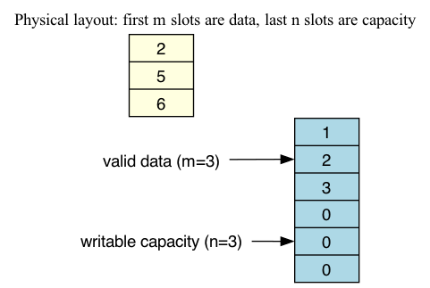
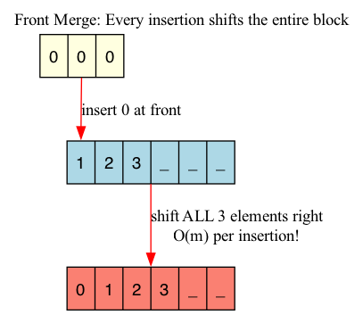
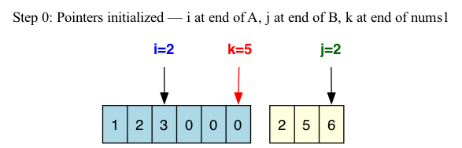
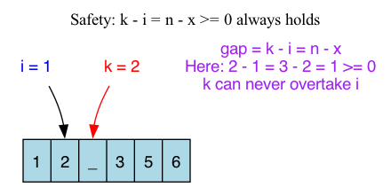

# 088: Merge Sorted Array

- **Difficulty:** Easy
- **Tags:** Array, Two Pointers
- **Pattern:** Backward in-place merge

## Fundamentals

### Problem Contract
You are given two sorted integer arrays, `nums1` and `nums2`, together with counts `m` and `n`.

- `nums1` has total length `m + n`, but only its first `m` positions contain valid input data.
- `nums2` has length `n`, and all of its elements are valid input.
- The remaining `n` positions at the end of `nums1` are writable capacity reserved for the merge.
- The merged result must be written back into `nums1`.

These details force the shape of the solution:
- Because both inputs are already sorted, the largest remaining element is always at the tail of one of the two arrays.
- Because the free space is at the end of `nums1`, writing from the back avoids overwriting unread data.
- Because the function modifies `nums1` in place, using a full temporary output array is outside the intended constraint.

### Definitions and State Model
Let
- `A = nums1[0..m-1]` be the valid original portion of `nums1`,
- `B = nums2[0..n-1]`,
- `i = m - 1` be the read-head for the tail of `A`,
- `j = n - 1` be the read-head for the tail of `B`,
- `k = m + n - 1` be the write-head for the next slot in `nums1`.

At each step, the algorithm compares the largest unplaced elements `A[i]` and `B[j]` and writes the larger one into `nums1[k]`.

### Key Lemma / Invariant / Recurrence
#### Sorted-Suffix Invariant
After each iteration, `nums1[k+1 .. m+n-1]` is a sorted suffix containing the largest elements already placed from `A ∪ B`.

#### Safety Lemma
Let `x` be the number of elements already taken from `B`, and `y` the number already taken from `A`. Then
\[
k = (m+n-1) - (x+y), \qquad i = (m-1) - y,
\]
so
\[
k - i = n - x.
\]
Since `x <= n`, we always have `k - i >= 0`.

This means the write-head `k` never moves left of the unread tail of `A`. The algorithm never overwrites an element of `A` before reading it.

### Algorithm
Initialize the three pointers at the tails and repeatedly place the largest remaining element at position `k`.

```text
i = m - 1
j = n - 1
k = m + n - 1

while j >= 0:
    if i >= 0 and nums1[i] > nums2[j]:
        nums1[k] = nums1[i]
        i -= 1
    else:
        nums1[k] = nums2[j]
        j -= 1
    k -= 1
```

The loop only guards on `j >= 0`. Once `B` is exhausted, any remaining prefix of `A` is already in its correct position.

### Correctness Proof
We prove that the algorithm leaves `nums1` equal to the sorted merge of the original inputs.

**Initialization.** Before the first iteration, the suffix `nums1[k+1 .. m+n-1]` is empty, so the sorted-suffix invariant holds trivially.

**Maintenance.** Assume the invariant holds at the start of an iteration.

- If `i >= 0` and `nums1[i] > nums2[j]`, then `nums1[i]` is the largest unplaced element overall because both `A` and `B` are sorted. Writing it at position `k` extends the sorted suffix by one correct element.
- Otherwise, `nums2[j]` is at least as large as every other unplaced element, so writing it at position `k` also extends the sorted suffix correctly.

In both cases, the safety lemma guarantees that the write-head does not overwrite an unread element of `A`. Therefore the next iteration starts from a valid state, and the invariant is preserved.

**Termination.** The loop stops when `j < 0`, meaning all elements of `B` have been placed. By the sorted-suffix invariant, the suffix already contains the largest merged elements in sorted order. Any remaining prefix of `A` was never moved and is already sorted, and every one of those remaining elements is less than or equal to the filled suffix. Therefore the entire `nums1` array is the correct sorted merge.

### Complexity Analysis
Let the total input size be `m + n`.

- Each iteration does `O(1)` work: one comparison, one array write, and constant-many pointer updates.
- Every iteration decrements `k` by exactly `1`.
- `k` starts at `m + n - 1`, so the loop runs at most `m + n` iterations.

Therefore the time complexity is `O(m + n)`.

For space:
- the algorithm allocates only the three integer variables `i`, `j`, and `k`,
- so the auxiliary space complexity is `O(1)`.

## Appendix

### Worked Example
Use `nums1 = [1, 2, 3, 0, 0, 0]`, `m = 3`, `nums2 = [2, 5, 6]`, `n = 3`.

| Step | `i` | `j` | `k` | Compare | Action | `nums1` |
|------|---:|---:|---:|---------|--------|---------|
| 0 | 2 | 2 | 5 | `3` vs `6` | write `6`, decrement `j` | `[1, 2, 3, 0, 0, 6]` |
| 1 | 2 | 1 | 4 | `3` vs `5` | write `5`, decrement `j` | `[1, 2, 3, 0, 5, 6]` |
| 2 | 2 | 0 | 3 | `3` vs `2` | write `3`, decrement `i` | `[1, 2, 3, 3, 5, 6]` |
| 3 | 1 | 0 | 2 | `2` vs `2` | write B's `2`, decrement `j` | `[1, 2, 2, 3, 5, 6]` |

After Step 3, `B` is exhausted, so the loop stops. The remaining prefix `[1, 2]` from `A` is already in place.

### Visuals
Only the visuals that materially clarify the backward merge are kept here.

#### 1. Layout and Capacity
This is the structural fact the algorithm exploits: valid data is on the left, writable capacity is on the right.

<div align="center">
  
</div>

Backward merge works because the free space is already exactly where the output suffix needs to be written.

#### 2. Why Front Insertion Is Expensive
This picture shows why merging from the front is the wrong instinct for arrays.

<div align="center">
  
</div>

Front insertion forces repeated shifts of contiguous array elements, which is the cost the backward strategy avoids.

#### 3. Pointer Initialization
All three pointers start at the tails of their active regions.

<div align="center">
  
</div>

The very first write lands in guaranteed capacity, not on top of unread input.

#### 4. Safety Invariant
This diagram is the visual version of `k - i = n - x >= 0`.

<div align="center">
  
</div>

The gap between the write-head and A's unread tail is exactly the number of B-elements still waiting to be placed.

### Why Naive / Wrong Approaches Fail
- **Append and sort:** Correct, but wastes the sorted structure already present in both arrays and costs `O((m+n)\log(m+n))`.
- **Merge from the front with shifting:** Every insertion into the front of an array shifts a contiguous suffix, leading to `O(mn)` worst-case work.
- **Allocate a full temporary output array:** Time stays linear, but space becomes `O(m+n)` and ignores the in-place constraint.

### Common Pitfalls
- **Wrong loop guard:** `while i >= 0 and j >= 0` exits too early when `A` is exhausted first, leaving elements of `B` uncopied.
- **Missing `i >= 0` guard in the comparison:** When `m = 0`, `i` starts at `-1`; reading `nums1[i]` without the guard is invalid.
- **Off-by-one initialization:** `i = m`, `j = n`, or `k = m+n` all point one slot past the correct tails.
- **Tie handling confusion:** Using `>` or `>=` is both correct. It only changes whether ties are taken from `A` or `B`.

### Variants / Follow-Ups
- **Merge two sorted linked lists:** The merge idea is the same, but there is no contiguous-array overwrite risk, so a forward merge is natural.
- **Merge `k` sorted lists:** The two-input invariant generalizes, but a heap is needed to keep the next smallest choice efficient.
- **Spare capacity at the front instead of the back:** The merge direction must reverse because the safe write region moves.
