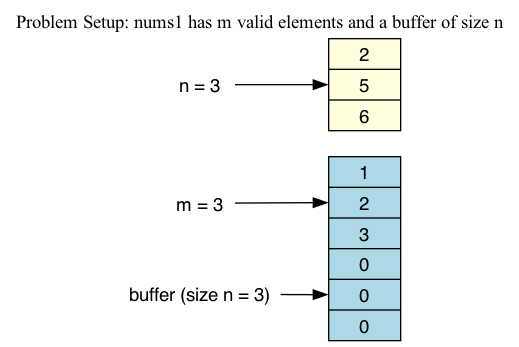
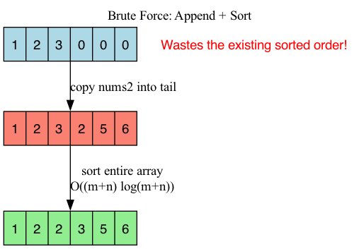
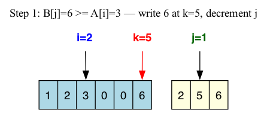
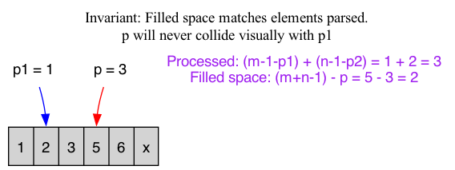
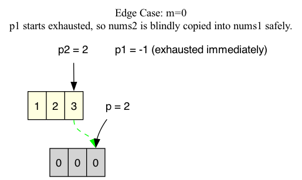

# 088: Merge Sorted Array

# Problem Metadata
- LeetCode Number: 088
- Difficulty: Easy
- Topic Tags: Array, Two Pointers, Sorting
- Primary Pattern: Two Pointers (Backwards)
- Secondary Pattern: In-Place Array Mutation
- Estimated Interview Signal: High (fundamental logic, pointer management, space complexity awareness)

# Problem Restatement & Implications
We are given two integer arrays, `nums1` and `nums2`, both sorted in non-decreasing order. We also have integers `m` and `n`, representing the valid elements in `nums1` and `nums2` respectively.
Our goal is to merge `nums2` into `nums1` so that `nums1` becomes a single array sorted in non-decreasing order.

**Implications:** 
  - `nums1` has a total pre-allocated length of `m + n`. The first `m` elements are valid data, while the last `n` elements are `0`s acting as raw buffer space.
  - Return type is `void`; we must modify `nums1` strictly **in-place**.
  - Arrays are already sorted. This implies $O((m+n)\log(m+n))$ sorting is suboptimal, and we should capitalize on the existing order to achieve $O(m+n)$ linear merging.

# Clarifying Questions
- "Are there negative numbers? Elements with duplicate values?" *(Yes, the logic handles duplicates naturally via `>=`)*.
- "If $m=0$, does `nums1` still have a length of $n$?" *(Yes, it's strictly pre-allocated).*
- "Should stability of duplicate elements be maintained, or does their relative order not matter?" *(Typically does not matter for simple integers).*

# Alternative Approaches & Tradeoffs

### 1. Concat and Built-in Sort (Brute Force)
- **Why it seems reasonable:** Concatenating the elements and using a standard library sort is an extremely low-effort, robust 1-liner in most languages. It guarantees correctness immediately.
- **Where its reasoning is incomplete/flawed:** It structurally assumes the incoming data has no prior ordering, intentionally wasting $O(N \log N)$ operations on data that is already strictly sorted.
- **Counterexample/Limitation:** Sorting inherently takes $O((m+n)\log(m+n))$ time. When $m$ and $n$ are astronomically large (e.g., merging two 1,000,000 element streams), a generalized sort will be orders of magnitude slower than a linear target merge and completely unacceptable in a production system.
- **Missing Proof Insight:** A true merge only ever requires localized pointer comparisons between the unmerged extremum (head/tail) of the two sorted sequences, totally bypassing global sorts.

### 2. Two Pointers from the Front with Shifting
- **Why it seems reasonable:** Reading left-to-right structurally mimics human intuition and perfectly mirrors how we linearly merge standard Linked Lists.
- **Where its reasoning is incomplete/flawed:** Standard Arrays are block-contiguous memory allocations. We mathematically cannot simply insert a value into the front of a heavily populated array without cascading shift operations on every remaining element to the right. 
- **Counterexample/Limitation:** If every element in `nums2` happens to be smaller than the very first element in `nums1`, every single insertion strictly requires shifting the entire `m` block of `nums1`. This degrades the worst-case time complexity to $O(m \times n) \approx O((m+n)^2)$.
- **Missing Proof Insight:** The available contiguous empty padding `n` strictly resides at the *end* of `nums1`. The proof dictates we must aggressively consume the buffer from the back to eliminate geometric shifting collisions entirely.

# Optimal Approach
Since the empty space is trailing, we can sort the arrays in reverse (largest to smallest) and place the largest elements at the very back of `nums1`.

**Algorithm Step-by-Step:**
1. Initialize three pointers: $p_1$ pointing to the end of `nums1`'s valid data ($m-1$), $p_2$ pointing to the end of `nums2` ($n-1$), and $p$ pointing to the literal end of `nums1` ($m+n-1$).
2. While elements remain in `nums2` ($p_2 \ge 0$):
3. Compare the elements at $nums1[p_1]$ and $nums2[p_2]$.
4. Take the larger of the two, place it at $nums1[p]$, and decrement the $p$ pointer and the pointer from which the element was taken.
5. If $p_1$ exhausts early, naturally copy the rest of `nums2` over via the `else` block.

# Correctness Argument

We must formally prove the invariant safety of backward merging directly into the exact boundary array we are actively reading from.

- **Invariant / Core Claim:** "At the conclusion of every individual loop iteration, the total number of populated elements securely locked in the tail buffer strictly matches the exact number of elements actively consumed from the back of `nums1` and `nums2`."
- **Initialization:** Before the loop executes, exactly 0 elements are processed, and 0 elements are placed in the padding space. The write-head $p = (m+n-1)$. The unread boundary of `nums1` is defined directly at $p_1 = m-1$. The mathematical distance between $p$ and $p_1$ is strictly exactly $n$.
- **Maintenance:** In every comparative step, we process exactly one extremum element from either `nums1` or `nums2` strictly by decrementing its respective pointer. Simultaneously, we write exactly one element firmly at $p$, decrementing $p$. The geometric distance between the write-head $p$ and the read-head $p_1$ decreases *only* if we pull from `nums2`. Since there are strictly exactly $n$ elements in `nums2`, $p$ can logically close the gap towards $p_1$ by an absolute maximum of $n$ steps. Since the initial gap is exactly established as $n$, $p$ structurally can never mathematically overtake $p_1$ under any permutations.
- **Termination:** The loop conditionally terminates firmly when $p_2 < 0$. With each bounded loop iteration, target $p$ strictly decreases monotonically. If elements are cleanly drawn from `nums2`, $p_2$ rigorously decreases toward $-1$. Since $nums2$ is finite (size $n$), strict termination is functionally guaranteed.
- **Conclusion:** The algorithm logically must terminate because we monotonically reduce the target bounds of $p_2$. Upon guaranteed termination, all source elements of $nums2$ are perfectly placed. The non-collision geometric invariant strongly ensures we never overwrote unread historical data in `nums1`. Thus, the greedy systemic choice to safely place bounding maximum elements directly at the rear constraint is rigorously safe and formally optimal!

# Visualizing the Algorithm

### 1. Problem Setup 
Shows the pre-allocated buffer trailing at the end, leading to the insight of backward merging.


### 2. Brute Force Re-Sorting
Visualizing why appending and then performing an $O(N \log N)$ sort is mathematically and structurally inefficient since it throws away initial states.


### 3. Pointer Transitions: Resolving the Back
Shows how pointers gracefully compare ending elements and drop the maximum directly into the buffer.


### 4. Invariant Preservation
Visually confirming that the `p` pointer (red) never overtakes the `p1` pointer (blue) because the processed items map $1:1$ with the consumed buffer.


### 5. Edge-Case Handling (Empty Initial Array)
If `m=0`, $p_1$ starts at $-1$. The algorithm effortlessly shifts to copying `nums2` directly into the buffer safely.


# Code Structure
```python
# Initialize pointers at the tails
p1 = m - 1
p2 = n - 1
p = m + n - 1

# Only nums2 dictates the critical loop termination
while p2 >= 0:
    if p1 >= 0 and nums1[p1] > nums2[p2]:
        # nums1 element is larger
        nums1[p] = nums1[p1]
        p1 -= 1
    else:
        # nums2 element is larger (or p1 exhausted)
        nums1[p] = nums2[p2]
        p2 -= 1
    p -= 1
```

# Complexity Analysis
- **Time Complexity:** $O(m + n)$. We touch each element in both arrays exactly once, doing $O(1)$ operations per element. The optimal approach is vastly superior to the Brute-Force $O((m+n)\log(m+n))$.
- **Space Complexity:** $O(1)$. We strictly mutate `nums1` in place without allocating auxiliary arrays (pointers require negligible, constant space), strictly superior to constructing temporary arrays.

# Edge Cases & Pitfalls
- **Edge Case: `n == 0`**: Loop never runs. `nums1` is perfectly untouched. Safe.
- **Edge Case: `m == 0`**: $p_1 = -1$ immediately. The conditional falls straight to the `else` block, smoothly copying all of `nums2` into `nums1`. Safe.
- **Implementation Pitfall:** Using `while p1 >= 0 and p2 >= 0:` loop logic. Using this structure requires a second manually unrolled `while p2 >= 0` loop afterward to catch elements if $nums1$ ran out first. The target optimal structure cleverly delegates the exhaustion of $p_1$ directly inside the main loop via the `p1 >= 0` guard in the `if` statement.

# Transferable Pattern Recognition
- **Two Pointers:** Canonical approach for merging, comparing, or reconciling pairs of sorted sequences.
- **In-place Array Modification (Back-to-Front Traversal):** When an array has padding to absorb new data, starting from the back prevents rippling shift operations and data overwrites.

# Problem Variations & Follow-Ups
- **Variation: Merge Sorted Linked Lists (LeetCode 21)**
  - *Change/Twist:* Arrays are swapped for Linked Lists.
  - *Approach:* The same core comparison applies, but we merge **front-to-back**. Because Linked List manipulation takes $O(1)$ time and doesn't require shifting neighbor nodes in memory, front-to-back is actually optimal. Space complexity stays $O(1)$.
- **Variation: Merge 'K' Sorted Arrays (LeetCode 23)**
  - *Change/Twist:* Generalizing 2 arrays to $K$ arrays.
  - *Approach:* Dual two-pointers breaks down. We must upgrade into a **Min-Heap (Priority Queue)** to efficiently track the smallest element across $K$ heads simultaneously to maintain an $O(N \log K)$ limit.

# Interview Simulation Questions

## In-Problem Follow-Ups
- "Why does your main loop only check `p2 >= 0` instead of `p1 >= 0 and p2 >= 0`?"
- "Can you guarantee that $p$ will never overwrite $p_1$ randomly before elements are processed?" 
- "If I restricted modifying variable definitions inside loops, could you write this cleanly?"

## Post-Solution Probes
- "If this was running in a highly constrained embedded system with almost zero L1 Cache, would you still use this array traversal?"
- "What if `nums1` was much, much larger than `nums2` (e.g., $m = 1,000,000$, $n=10$)? Does the Time Complexity change your algorithm choice?" *(Insight: Binary Search merging).*
- "Prove that algorithm is structurally robust even if elements duplicate consecutively heavily."

# Role-Relevant Technical Questions
- "If you were merging millions of arrays originating from independent microservice packet streams in production, how would you design the aggregation system rather than just a single thread loop?"
- "How would you unit-test this logic to ensure extreme bounds (like sizes at max integer bounds) don't trigger index failures?"

# Self-Test Questions
1. How does navigating `nums1` back-to-front solve the strict $O(1)$ space constraint compared to front-to-back?
2. Trace the single-loop `if/else` logic exactly when `p1` hits `-1`. How does the code proceed without triggering an `IndexOutOfBounds` error?
3. What is the Big-O Time Complexity of systematically shifting an array index rightwards, and how does that validate our architectural choice here?
4. What visually proves that the tail index $p$ never collides with $p_1$?

# Next Step Before Coding
Ensure you can map the pointer locations on a whiteboard for the edge case where `m = 0` and `n = 3`. Once you can trace logically why $p_1 = -1$ routes `nums2`'s values via the `else` block to naturally copy over, you are ready to write the implementation completely from memory.
