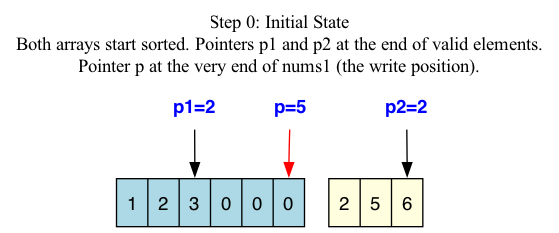
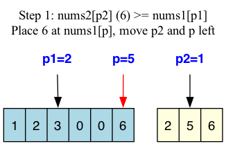
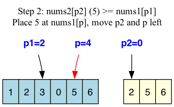
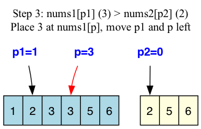
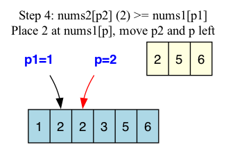

# 088 Merge Sorted Array

Merge `nums1` and `nums2` into a single array sorted in non-decreasing order.

`nums1` has a length of `m + n`, where the first `m` elements denote the elements that should be merged, and the last `n` elements are set to `0` and should be ignored. `nums2` has a length of `n`.

## Solution

We use a mathematical approach with two pointers, traversing the arrays from the end to the beginning. Let:
- $p_1 = m - 1$ (pointer to the last valid element in `nums1`)
- $p_2 = n - 1$ (pointer to the last valid element in `nums2`)
- $p = m + n - 1$ (pointer to the last available position in `nums1`)

At each step, we rigorously compare $nums1[p_1]$ and $nums2[p_2]$, pick the larger one, and place it at $nums1[p]$. If $p_1 < 0$, we just copy the rest of $nums2$. If $p_2 < 0$, we are done since $nums1$ is already in place.

### Step 0: Initial state

Initial state where $p_1=2$, $p_2=2$, and $p=5$.

### Step 1: Compare $nums1[p_1]$ and $nums2[p_2]$

We see $nums1[2] (3) \le nums2[2] (6)$. We place $6$ at $nums1[5]$, then decrement $p_2$ and $p$.

### Step 2: Compare again

$nums1[2] (3) \le nums2[1] (5)$. We place $5$ at $nums1[4]$, then decrement $p_2$ and $p$.

### Step 3: Compare again

$nums1[2] (3) > nums2[0] (2)$. We place $3$ at $nums1[3]$, then decrement $p_1$ and $p$.

### Step 4: Compare again

$nums1[1] (2) \le nums2[0] (2)$. We place $2$ at $nums1[2]$, then decrement $p_2$ and $p$.

### Step 5: Termination

$p_2$ has fallen below 0. The remaining elements in $nums1$ are already correctly positioned, so the algorithm terminates.

## Fundamentals

- **Two-pointer approach (from the back).** If we start from the beginning of `nums1`, we would overwrite elements before we are done with them. By starting from the back, where the empty `0`s are padding the array, we guarantee we never overwrite an unread valid element.
- **In-place modification.** This uses $O(1)$ extra space because we re-use the pre-allocated space in `nums1`.
- **Termination Conditions.** The algorithm safely stops once $p_2 < 0$. If $p_1 < 0$ first, the loop must continue to copy the remainder of `nums2` into `nums1`.
