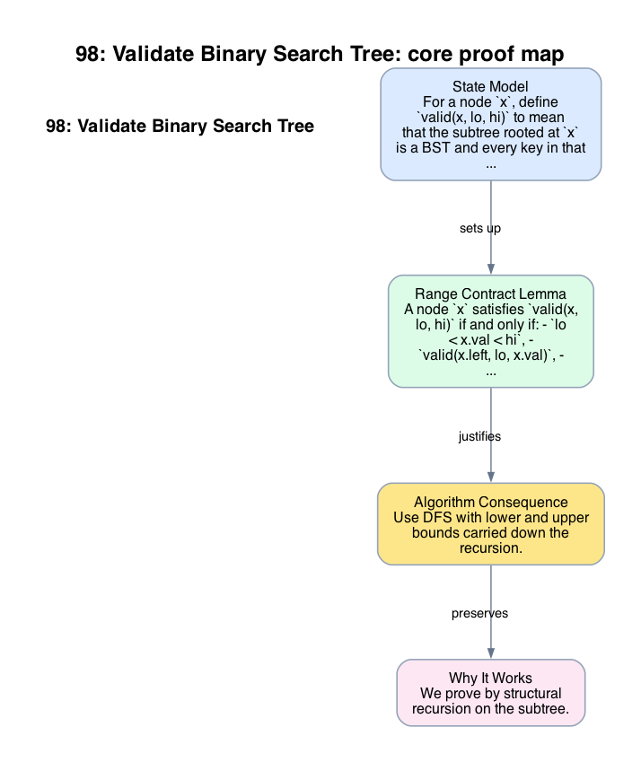

# 98: Validate Binary Search Tree

- **Difficulty:** Medium
- **Tags:** Tree, Depth-First Search, Binary Search Tree
- **Pattern:** Recursive range contract

## Fundamentals

### Problem Contract
Given the root of a binary tree, return whether the tree satisfies the binary search tree contract:
- every key in the left subtree of a node `x` is strictly less than `x.val`,
- every key in the right subtree of `x` is strictly greater than `x.val`,
- and both subtrees satisfy the same rule recursively.

The comparison is strict, so duplicates violate the contract.

### Definitions and State Model
For a node `x`, define `valid(x, lo, hi)` to mean that the subtree rooted at `x` is a BST and every key in that subtree lies in the open interval `(lo, hi)`.

The root is valid exactly when `valid(root, -inf, +inf)` holds.

### Key Lemma / Invariant / Recurrence
#### Range Contract Lemma
A node `x` satisfies `valid(x, lo, hi)` if and only if:
- `lo < x.val < hi`,
- `valid(x.left, lo, x.val)`,
- `valid(x.right, x.val, hi)`.

This is the exact recursive form of the BST definition. Local parent-child comparisons alone are insufficient because a violation can be introduced by an ancestor bound.

### Algorithm
Use DFS with lower and upper bounds carried down the recursion.

```text
valid(node, lo, hi):
    if node is null:
        return true
    if node.val <= lo or node.val >= hi:
        return false
    return valid(node.left, lo, node.val)
       and valid(node.right, node.val, hi)

return valid(root, -inf, +inf)
```

### Correctness Proof
We prove by structural recursion on the subtree.

For the base case `node = null`, the empty tree satisfies the BST contract, so returning `true` is correct.

For the inductive step, consider a non-null node `x`. By the range contract lemma, the subtree rooted at `x` is valid exactly when `x.val` lies between the inherited bounds and both recursive subtrees satisfy their tightened bounds. The algorithm checks precisely those three conditions. If any one fails, the BST contract fails. If all three hold, then every value in the left subtree is less than `x.val`, every value in the right subtree is greater than `x.val`, and both subtrees are BSTs, so the whole subtree is a BST.

Applying the argument at the root with infinite bounds proves that the algorithm returns `true` exactly for valid BSTs.

### Complexity Analysis
Let `n` be the number of nodes.

- Each node is visited once.
- Each visit performs `O(1)` comparisons and recursive calls.

The running time is `O(n)`. The auxiliary space is `O(h)` for recursion depth, where `h` is the tree height; this is `O(log n)` for a balanced tree and `O(n)` in the worst case.

## Appendix

### Visuals

#### 1. Core Proof Map
This image is the required appendix visual for the note.

<div align="center">
  
</div>

This diagram compresses the state model, key claim, and algorithm consequence into one view so the proof spine is easier to reconstruct from memory.

### Common Pitfalls
- Checking only `node.left.val < node.val < node.right.val` misses ancestor-bound violations such as a large value hidden in the left subtree.
- Using closed intervals accepts duplicates, which is incorrect for the strict BST contract.
