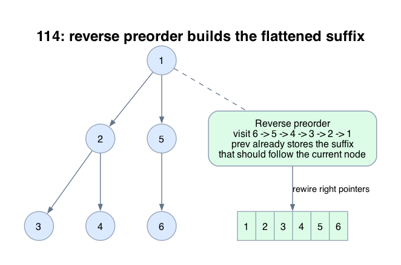

# 114: Flatten Binary Tree to Linked List

- **Difficulty:** Medium
- **Tags:** Linked List, Stack, Tree, Depth-First Search
- **Pattern:** Reverse-preorder rewiring

## Fundamentals

### Problem Contract
Transform the binary tree in place into a right-skewed linked list following preorder order. After flattening, every node must have `left = null`, and following `right` pointers must visit nodes in preorder.

### Definitions and State Model
Use a pointer `prev` to the already flattened prefix that should follow the current node in the final list.

Process nodes in reverse preorder: `right`, then `left`, then `node`.

### Key Lemma / Invariant / Recurrence
#### Reverse-Preorder Invariant
After recursively processing the original right subtree and then the original left subtree of `node`, `prev` points to the flattened list representing the preorder sequence that should come after `node`.

Therefore rewiring
```text
node.right = prev
node.left = null
prev = node
```
places `node` in front of exactly the correct suffix.

### Algorithm
Run DFS in reverse preorder.

```text
prev = null

dfs(node):
    if node is null:
        return
    dfs(node.right)
    dfs(node.left)
    node.right = prev
    node.left = null
    prev = node

dfs(root)
```

### Correctness Proof
The invariant is trivial at a null node.

Assume it holds for the children of `node`. After `dfs(node.right)`, `prev` is the flattened preorder list of the original right subtree. After `dfs(node.left)`, `prev` becomes the flattened preorder list of the original left subtree followed by the flattened preorder list of the original right subtree. That is exactly the suffix that should follow `node` in preorder.

Setting `node.right = prev` and `node.left = null` therefore makes the list starting at `node` equal to `node`, then preorder(left subtree), then preorder(right subtree). Updating `prev = node` preserves the invariant for the caller. By induction, the whole tree is flattened correctly.

### Complexity Analysis
Let `n` be the number of nodes.

- Each node is visited once.
- Each visit performs `O(1)` rewiring work.

The running time is `O(n)`. The auxiliary space is `O(h)` for recursion depth, where `h` is the tree height.

## Appendix

### Visuals

#### 1. Reverse Preorder Builds The Correct Suffix
This image is the required appendix visual for the note.

<div align="center">
  
</div>

The reverse-preorder order is the non-obvious part. This sketch shows that `prev` already represents the list suffix that should follow the current node.

### Common Pitfalls
- Processing `left` before `right` with the same `prev` strategy produces the wrong order.
- Forgetting `node.left = null` leaves the structure as a tree instead of a linked list.
