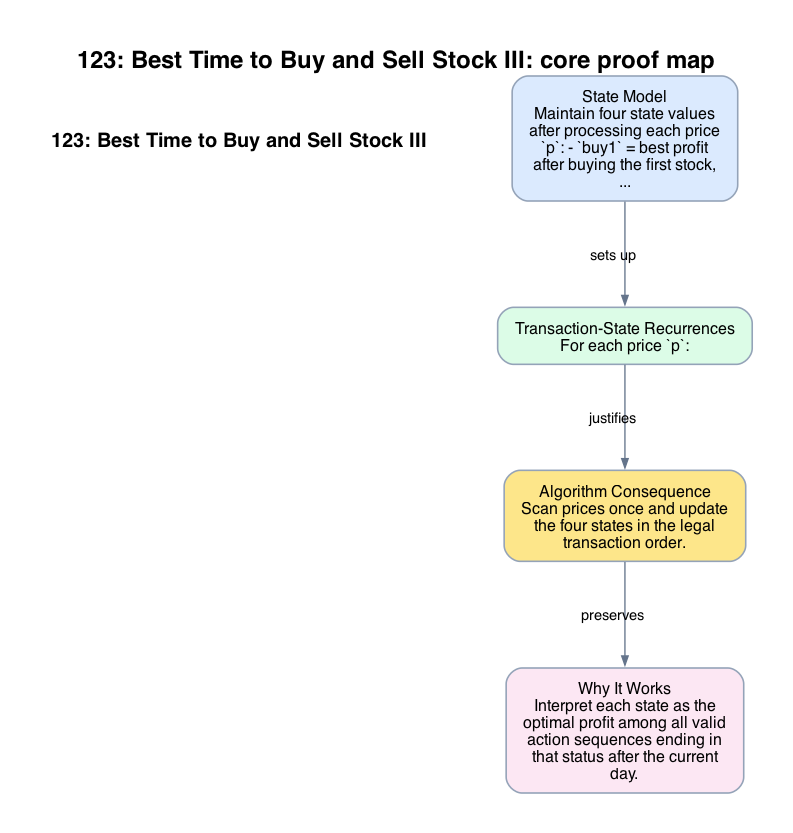

# 123: Best Time to Buy and Sell Stock III

- **Difficulty:** Hard
- **Tags:** Array, Dynamic Programming
- **Pattern:** Constant-state transaction DP

## Fundamentals

### Problem Contract
Given daily prices, return the maximum profit achievable with at most two completed buy-sell transactions. At most one share may be held at a time.

### Definitions and State Model
Maintain four state values after processing each price `p`:
- `buy1` = best profit after buying the first stock,
- `sell1` = best profit after selling the first stock,
- `buy2` = best profit after buying the second stock,
- `sell2` = best profit after selling the second stock.

These states already encode the transaction order constraints.

### Key Lemma / Invariant / Recurrence
#### Transaction-State Recurrences
For each price `p`:
```text
buy1  = max(buy1, -p)
sell1 = max(sell1, buy1 + p)
buy2  = max(buy2, sell1 - p)
sell2 = max(sell2, buy2 + p)
```
Each recurrence chooses between keeping the previous best state or performing the next legal action at price `p`.

### Algorithm
Scan prices once and update the four states in the legal transaction order.

```text
buy1 = -inf
sell1 = 0
buy2 = -inf
sell2 = 0
for p in prices:
    buy1 = max(buy1, -p)
    sell1 = max(sell1, buy1 + p)
    buy2 = max(buy2, sell1 - p)
    sell2 = max(sell2, buy2 + p)
return sell2
```

### Correctness Proof
Interpret each state as the optimal profit among all valid action sequences ending in that status after the current day. Initially `sell1 = sell2 = 0` because doing nothing yields zero profit, and the buy states are impossible before any purchase.

At a new price `p`, each recurrence is exhaustive. For example, `buy2` either keeps the best earlier value or performs the second buy today after some optimal first sale, which has value `sell1 - p`. The other states are analogous. Because updates use only states representing legal earlier stages, no invalid sequence is introduced.

By induction over days, each state remains optimal for its meaning. The answer is `sell2`, because the final profit with at most two transactions is maximized by ending after the second sale or by leaving the second transaction unused, which `sell2` already subsumes through the `max` updates.

### Complexity Analysis
Let `n = len(prices)`.

- The scan visits each price once.
- Each day performs `O(1)` updates.

The running time is `O(n)`. The auxiliary space is `O(1)`.

## Appendix

### Visuals

#### 1. Core Proof Map
This image is the required appendix visual for the note.

<div align="center">
  
</div>

This diagram compresses the state model, key claim, and algorithm consequence into one view so the proof spine is easier to reconstruct from memory.

### Common Pitfalls
- Summing the two best single-transaction profits from disjoint intervals is not enough because the optimal split point is part of the DP state.
- Updating the states out of transaction order can accidentally allow using the same price in an illegal way.
