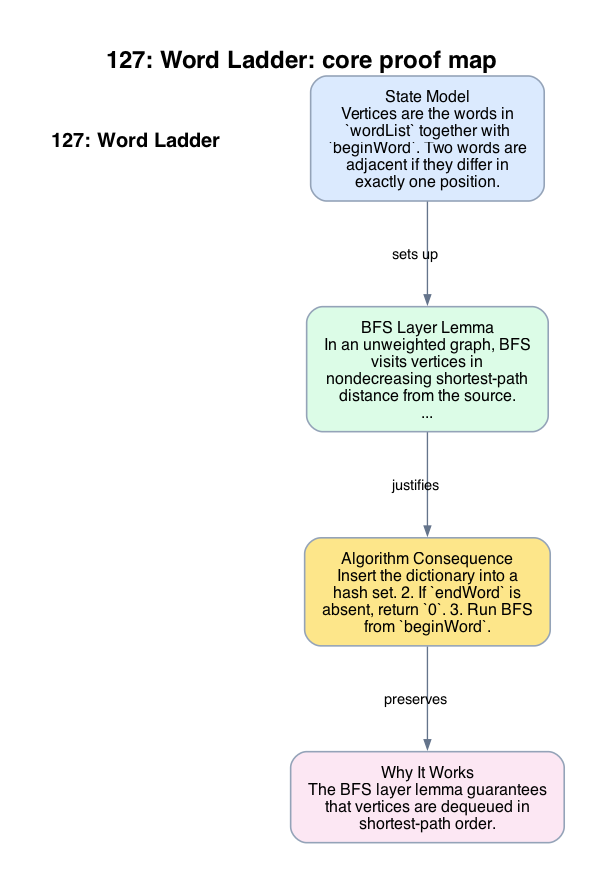

# 127: Word Ladder

- **Difficulty:** Hard
- **Tags:** Hash Table, String, Breadth-First Search
- **Pattern:** BFS on an implicit unweighted graph

## Fundamentals

### Problem Contract
Given `beginWord`, `endWord`, and a dictionary `wordList`, each move changes exactly one character and the intermediate word must belong to the dictionary. Return the minimum number of words in a transformation sequence from `beginWord` to `endWord`, or `0` if none exists.

Every edge has unit cost, so the problem is shortest path in an unweighted graph.

### Definitions and State Model
Vertices are the words in `wordList` together with `beginWord`. Two words are adjacent if they differ in exactly one position.

Maintain a BFS queue of `(word, distance)` pairs and a visited set. Distance means number of words in the path from `beginWord` to the current word.

### Key Lemma / Invariant / Recurrence
#### BFS Layer Lemma
In an unweighted graph, BFS visits vertices in nondecreasing shortest-path distance from the source. Therefore the first time `endWord` is dequeued, its distance is minimal.

#### Neighbor-Generation Rule
For a word of length `L`, every graph neighbor can be generated by replacing one position with one of `26` letters and checking dictionary membership.

### Algorithm
1. Insert the dictionary into a hash set.
2. If `endWord` is absent, return `0`.
3. Run BFS from `beginWord`.
4. For each dequeued word, generate every one-letter mutation and enqueue unseen dictionary words.

```text
dict = set(wordList)
if endWord not in dict:
    return 0
queue = [(beginWord, 1)]
visited = {beginWord}
while queue not empty:
    word, dist = pop_front(queue)
    if word == endWord:
        return dist
    for each position i:
        for each letter ch:
            nxt = word with position i replaced by ch
            if nxt in dict and nxt not in visited:
                visited.add(nxt)
                push_back(queue, (nxt, dist + 1))
return 0
```

### Correctness Proof
The BFS layer lemma guarantees that vertices are dequeued in shortest-path order. Every enqueued neighbor is reachable in exactly one more step than its parent because it differs by one letter and belongs to the dictionary. Thus every queue entry carries a correct path length.

If the algorithm returns `dist` when dequeuing `endWord`, that path is valid and minimal by the layer lemma. If the algorithm exhausts the queue, then every word reachable from `beginWord` in the implicit graph has been explored and `endWord` was never reached, so no valid transformation exists and returning `0` is correct.

### Complexity Analysis
Let `N = len(wordList)` and `L = word length`.

- Building the set costs `O(NL)` to store the words.
- Each visited word generates `26L` candidate mutations.
- Each candidate check is `O(L)` to materialize a word string, or `O(1)` average membership after construction.

A direct mutation-based implementation runs in `O(N * 26 * L^2)` time in a language where each generated string copy costs `O(L)`. The auxiliary space is `O(NL)` for the dictionary, visited set, and queue.

## Appendix

### Visuals

#### 1. Core Proof Map
This image is the required appendix visual for the note.

<div align="center">
  
</div>

This diagram compresses the state model, key claim, and algorithm consequence into one view so the proof spine is easier to reconstruct from memory.

### Common Pitfalls
- DFS can find a path, but it does not preserve shortest-path distance in an unweighted graph.
- Failing to mark words visited at enqueue time can insert the same vertex many times and destroy the intended complexity.
