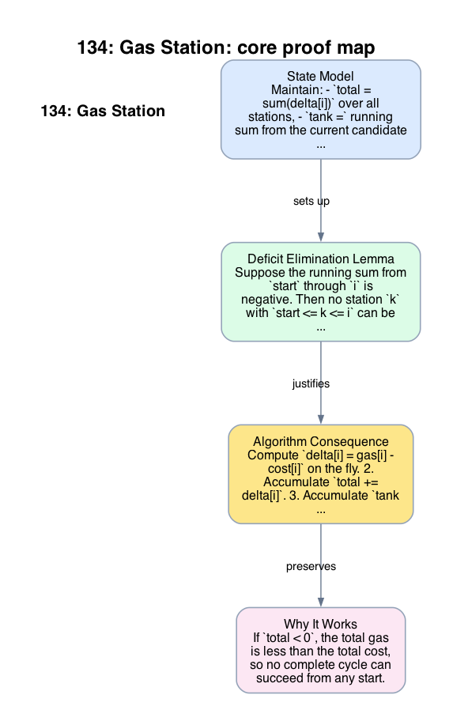

# 134: Gas Station

- **Difficulty:** Medium
- **Tags:** Array, Greedy
- **Pattern:** Prefix-deficit elimination

## Fundamentals

### Problem Contract
Given arrays `gas` and `cost` of equal length `n`, station `i` contributes net gain
```text
delta[i] = gas[i] - cost[i].
```
Starting with empty tank at some station `s`, the tour is feasible if the running sum of `delta` along the circular route never drops below `0`. Return the unique feasible start index if one exists; otherwise return `-1`.

### Definitions and State Model
Maintain:
- `total = sum(delta[i])` over all stations,
- `tank =` running sum from the current candidate start `start` to the current index `i`,
- `start =` leftmost station not yet disproved.

`total` decides existence. `start` and `tank` decide the candidate when existence is guaranteed.

### Key Lemma / Invariant / Recurrence
#### Deficit Elimination Lemma
Suppose the running sum from `start` through `i` is negative. Then no station `k` with `start <= k <= i` can be a feasible start.

Reason: for any such `k`, the partial sum from `k` through `i` is at most the failing sum from `start` through `i` after removing a nonnegative prefix that had never gone negative before `i`. Therefore that route also fails before leaving station `i`.

#### Candidate Invariant
After processing index `i`, every station strictly left of `start` has already been disproved as a feasible start.

### Algorithm
1. Compute `delta[i] = gas[i] - cost[i]` on the fly.
2. Accumulate `total += delta[i]`.
3. Accumulate `tank += delta[i]` for the current candidate `start`.
4. Whenever `tank < 0`, apply the deficit elimination lemma: set `start = i + 1` and reset `tank = 0`.
5. After the scan, return `start` if `total >= 0`; otherwise return `-1`.

```text
start = 0
tank = 0
total = 0
for i in 0 .. n-1:
    d = gas[i] - cost[i]
    total += d
    tank += d
    if tank < 0:
        start = i + 1
        tank = 0
if total < 0:
    return -1
return start
```

### Correctness Proof
If `total < 0`, the total gas is less than the total cost, so no complete cycle can succeed from any start. Returning `-1` is therefore necessary.

Now assume `total >= 0`. During the scan, whenever `tank < 0` at index `i`, the deficit elimination lemma proves that every station from the current `start` through `i` is impossible. Resetting `start` to `i+1` preserves the candidate invariant because all earlier stations are now disproved.

At the end of the scan, every station before `start` is impossible, and no failure occurred from `start` to the end of the array after the last reset. Because `total >= 0`, the net surplus on the suffix from `start` to `n-1` is enough to cover the prefix from `0` to `start-1`. Thus the circular traversal from `start` never goes negative, so `start` is feasible. Therefore the algorithm returns `-1` exactly when no solution exists, and otherwise returns the feasible start.

### Complexity Analysis
Let `n = len(gas)`.

- The scan visits each station once.
- Each iteration performs constant work.

The running time is `O(n)` and the auxiliary space is `O(1)`.

## Appendix

### Visuals

#### 1. Core Proof Map
This image is the required appendix visual for the note.

<div align="center">
  
</div>

This diagram compresses the state model, key claim, and algorithm consequence into one view so the proof spine is easier to reconstruct from memory.

### Common Pitfalls
- Checking only local conditions such as `gas[i] >= cost[i]` misses starts that require surplus carried from earlier stations.
- Resetting `start` when `tank == 0` is unnecessary; only a negative running sum disproves the current candidate.
