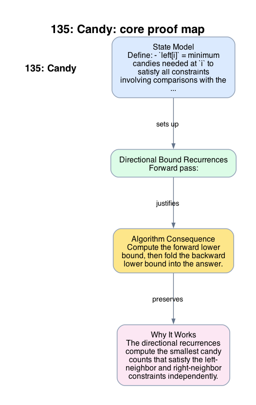

# 135: Candy

- **Difficulty:** Hard
- **Tags:** Array, Greedy
- **Pattern:** Two directional lower bounds

## Fundamentals

### Problem Contract
Each child must receive at least one candy. If `ratings[i] > ratings[i-1]`, then child `i` must receive more candies than child `i-1`. If `ratings[i] > ratings[i+1]`, then child `i` must receive more candies than child `i+1`. Return the minimum total candies satisfying all constraints.

### Definitions and State Model
Define:
- `left[i]` = minimum candies needed at `i` to satisfy all constraints involving comparisons with the left neighbor only,
- `right[i]` = minimum candies needed at `i` to satisfy all constraints involving comparisons with the right neighbor only.

The minimal globally feasible assignment is
```text
candies[i] = max(left[i], right[i]).
```

### Key Lemma / Invariant / Recurrence
#### Directional Bound Recurrences
Forward pass:
```text
left[0] = 1,
left[i] = left[i-1] + 1 if ratings[i] > ratings[i-1], else 1.
```
Backward pass:
```text
right[n-1] = 1,
right[i] = right[i+1] + 1 if ratings[i] > ratings[i+1], else 1.
```
These are the smallest assignments satisfying the one-sided constraints.

#### Minimal-Combination Lemma
Any globally feasible assignment must satisfy both one-sided lower bounds, so it must have `candies[i] >= max(left[i], right[i])` for every `i`. Choosing equality at every `i` is therefore the pointwise minimum feasible assignment.

### Algorithm
Compute the forward lower bound, then fold the backward lower bound into the answer.

```text
left[0] = 1
for i in 1 .. n-1:
    left[i] = left[i-1] + 1 if ratings[i] > ratings[i-1] else 1

ans = left[n-1]
right = 1
for i in n-2 down to 0:
    right = right + 1 if ratings[i] > ratings[i+1] else 1
    ans += max(left[i], right)
return ans
```

### Correctness Proof
The directional recurrences compute the smallest candy counts that satisfy the left-neighbor and right-neighbor constraints independently. By the minimal-combination lemma, any globally feasible assignment must dominate both lower bounds pointwise.

Now assign `candies[i] = max(left[i], right[i])`. This satisfies both types of neighbor inequalities because it is at least the required lower bound from each direction. Since no smaller value at any index can satisfy both bounds simultaneously, this assignment is pointwise minimal and therefore has the minimum possible total sum.

Thus the algorithm returns the minimum total candies.

### Complexity Analysis
Let `n = len(ratings)`.

- The forward pass and backward pass each scan the array once.
- Each step performs `O(1)` work.

The running time is `O(n)`. The auxiliary space is `O(n)` for `left`; the backward bound is maintained in `O(1)` space.

## Appendix

### Visuals

#### 1. Core Proof Map
This image is the required appendix visual for the note.

<div align="center">
  
</div>

This diagram compresses the state model, key claim, and algorithm consequence into one view so the proof spine is easier to reconstruct from memory.

### Common Pitfalls
- A single left-to-right greedy pass fails on descending runs because right-neighbor constraints are still unknown.
- Equal ratings do not impose a strict inequality, so both directional recurrences reset to `1` there.
