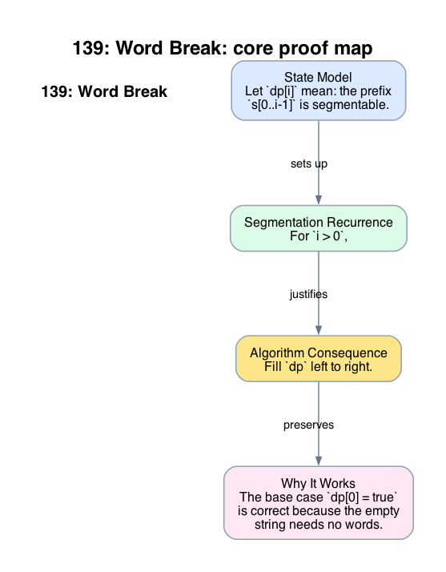

# 139: Word Break

- **Difficulty:** Medium
- **Tags:** Hash Table, String, Dynamic Programming
- **Pattern:** Prefix segmentation DP

## Fundamentals

### Formal Statement of the Problem

Let $\Sigma$ be a finite alphabet. Let

$$
s = \langle s_0, s_1, \dots, s_{n-1} \rangle \in \Sigma^n
$$

be the input string, viewed as a sequence of length $n$. Let

$$
D \subseteq \Sigma^\ast
$$

be the dictionary obtained from `wordDict` under set semantics. Duplicate dictionary entries are irrelevant to the predicate being computed.

For integers $a,b$ with $0 \le a \le b \le n$, write

$$
s[a:b)
$$

for the contiguous substring of $s$ beginning at position $a$ and ending just before position $b$.

Define the prefix-length index set

$$
I_n := \{0,1,\dots,n\}.
$$

For each $i \in I_n$, define the segmentation predicate

$$
\operatorname{Seg}(i)
$$

by

$$
\operatorname{Seg}(i)
\iff
\exists m \in \mathbb{N}_0,\ \exists\, 0 = t_0 < t_1 < \cdots < t_m = i
\text{ such that }
s[t_{r-1}:t_r) \in D
\text{ for every } r \in \{1,\dots,m\}.
$$

The objective is to determine the truth value of $\operatorname{Seg}(n)$.

### Domain, Variables, Assumptions, Constraints, and State Space

The state space is

$$
S := I_n.
$$

State $i \in S$ denotes the subproblem:

"Is the prefix $s[0:i)$ segmentable into dictionary words?"

This note uses prefix lengths, not character indices, as states. Therefore state $i$ refers to a prefix ending just before position $i$, and the empty prefix is represented by state $0$.

For a fixed state $i$, the search space consists of all strictly increasing cut sequences

$$
0 = t_0 < t_1 < \cdots < t_m = i
$$

whose induced blocks all lie in $D$.

The required output is a feasibility predicate, not a minimum number of words, not a count of segmentations, and not a reconstruction of one segmentation.

### Formal Statement of the Definition

Define the dynamic programming table by

$$
dp[i] := \operatorname{Seg}(i)
\quad \text{for every } i \in I_n.
$$

The table entry $dp[i]$ is therefore a Boolean value with exact semantics:

- `true` means that the prefix $s[0:i)$ admits at least one valid cut sequence,
- `false` means that no such cut sequence exists.

The base state is

$$
dp[0] = \operatorname{Seg}(0) = \mathrm{true},
$$

because the empty prefix is witnessed by the empty cut sequence of length $0$.

For $0 \le j < i \le n$, define the predecessor relation

$$
R(j,i) \iff s[j:i) \in D.
$$

The recurrence will depend only on predecessor states $j < i$.

### Derivation of Properties and Proof Obligations

#### Lemma 1: Last-Block Decomposition

For every $i \in I_n$ with $i > 0$,

$$
\operatorname{Seg}(i)
\iff
\exists j \in \{0,\dots,i-1\}
\text{ such that }
\operatorname{Seg}(j) \land R(j,i).
$$

#### Proof

$(\Rightarrow)$ Assume $\operatorname{Seg}(i)$ holds. Then there exists a valid cut sequence

$$
0 = t_0 < t_1 < \cdots < t_m = i
$$

with each block $s[t_{r-1}:t_r)$ in $D$. Because $i > 0$, one has $m \ge 1$. Let $j := t_{m-1}$. Then $j < i$, the final block satisfies $s[j:i) \in D$, and the shorter cut sequence

$$
0 = t_0 < t_1 < \cdots < t_{m-1} = j
$$

witnesses $\operatorname{Seg}(j)$. Hence

$$
\operatorname{Seg}(j) \land R(j,i)
$$

holds for some $j < i$.

$(\Leftarrow)$ Assume there exists $j < i$ such that $\operatorname{Seg}(j)$ and $R(j,i)$ both hold. By $\operatorname{Seg}(j)$, there exists a valid cut sequence ending at $j$. Appending the final block $s[j:i)$, which lies in $D$, yields a valid cut sequence ending at $i$. Therefore $\operatorname{Seg}(i)$ holds.

This proves the equivalence.

#### Consequence: Exact Recurrence

By the definition of $dp[i]$ and Lemma 1, for every $i > 0$,

$$
dp[i]
=
\bigvee_{j=0}^{i-1}
\bigl(dp[j] \land (s[j:i) \in D)\bigr).
$$

This is an exact feasibility recurrence. It is neither a heuristic nor a relaxation.

#### Proof Obligation: Acyclic Dependence

Every dependency of state $i$ refers to a state $j$ satisfying $j < i$. Therefore the natural increasing order

$$
0,1,2,\dots,n
$$

is a valid topological order for tabulation.

### Algorithm

Evaluate the states in increasing prefix length.

```text
dict = set(wordDict)
dp = [false] * (n + 1)
dp[0] = true
for i in 1 .. n:
    for j in 0 .. i-1:
        if dp[j] and s[j:i] in dict:
            dp[i] = true
            break
return dp[n]
```

### Correctness Proof

We prove by induction on $i \in I_n$ that after state $i$ has been processed, the equality

$$
dp[i] = \operatorname{Seg}(i)
$$

holds.

#### Base State

For $i = 0$, the table is initialized with $dp[0] = \mathrm{true}$. This equals $\operatorname{Seg}(0)$ by the definition of the empty cut sequence.

#### Inductive Step

Fix $i > 0$ and assume that for all $j < i$, the values $dp[j]$ already equal $\operatorname{Seg}(j)$.

During the computation of $dp[i]$, the algorithm checks each $j < i$. If it sets $dp[i] = \mathrm{true}$, then there exists some $j < i$ with

$$
dp[j] = \mathrm{true}
\quad \text{and} \quad
s[j:i) \in D.
$$

By the induction hypothesis, $dp[j] = \mathrm{true}$ implies $\operatorname{Seg}(j)$. Together with $s[j:i) \in D$, Lemma 1 yields $\operatorname{Seg}(i)$.

Conversely, assume $\operatorname{Seg}(i)$ holds. By Lemma 1, there exists $j < i$ such that $\operatorname{Seg}(j)$ and $s[j:i) \in D$. By the induction hypothesis, $dp[j] = \mathrm{true}$. Hence the inner loop will encounter such a $j$ and set $dp[i] = \mathrm{true}$.

Therefore

$$
dp[i] = \operatorname{Seg}(i)
$$

for all $i \in I_n$. In particular, the returned value $dp[n]$ equals the required answer $\operatorname{Seg}(n)$.

### Complexity Analysis

Let $n = |s|$.

The algorithm examines at most

$$
\sum_{i=1}^{n} i = \frac{n(n+1)}{2}
$$

candidate predecessor pairs $(j,i)$. This is an exact count of the maximum number of inner-loop iterations.

Under a cost model in which:

- hash-table membership in `dict` is $O(1)$ expected time, and
- substring access $s[j:i)$ is treated as $O(1)$,

the running time has worst-case asymptotic upper bound

$$
O(n^2).
$$

In languages or implementations where constructing $s[j:i)$ copies $\Theta(i-j)$ characters, the total running time has worst-case asymptotic upper bound

$$
O(n^3).
$$

The auxiliary-space upper bound is

$$
O(n + |D|),
$$

consisting of the Boolean table of length $n+1$ and the dictionary set representation.

## Appendix

### Visuals

#### 1. Core Proof Map
This image is the required appendix visual for the note.

<div align="center">
  
</div>

This diagram compresses the state model, key claim, and algorithm consequence into one view so the proof spine is easier to reconstruct from memory.

### Common Pitfalls
- Greedily taking the longest available dictionary word can block a valid segmentation later.
- Using only a set of prefix lengths is insufficient; the recurrence depends on which specific substrings are dictionary words.
