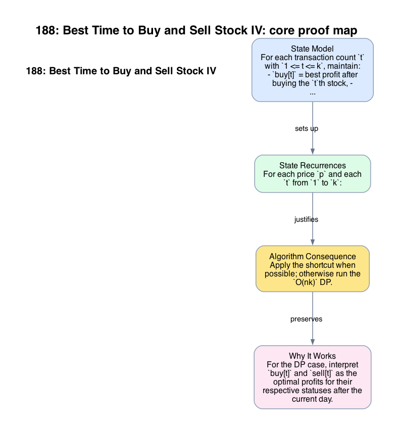

# 188: Best Time to Buy and Sell Stock IV

- **Difficulty:** Hard
- **Tags:** Array, Dynamic Programming
- **Pattern:** k-transaction state DP

## Fundamentals

### Problem Contract
Given daily prices and an integer `k`, return the maximum profit achievable with at most `k` completed buy-sell transactions. At most one share may be held at a time.

### Definitions and State Model
For each transaction count `t` with `1 <= t <= k`, maintain:
- `buy[t]` = best profit after buying the `t`th stock,
- `sell[t]` = best profit after selling the `t`th stock.

These states generalize the four-state model from the two-transaction case.

### Key Lemma / Invariant / Recurrence
#### State Recurrences
For each price `p` and each `t` from `1` to `k`:
```text
buy[t] = max(buy[t], sell[t-1] - p)
sell[t] = max(sell[t], buy[t] + p)
```
where `sell[0] = 0`. Each recurrence either preserves the previous best state or performs the next legal action at price `p`.

#### Unlimited-Transactions Shortcut
If `k >= n/2`, the transaction cap is nonbinding. Then the problem reduces to the unlimited-transactions case, whose optimum is the sum of all positive day-to-day increases.

### Algorithm
Apply the shortcut when possible; otherwise run the `O(nk)` DP.

```text
if k >= n // 2:
    return sum(max(0, prices[i] - prices[i-1]) for i in 1..n-1)

buy = [-inf] * (k + 1)
sell = [0] * (k + 1)
for p in prices:
    for t in 1 .. k:
        buy[t] = max(buy[t], sell[t-1] - p)
        sell[t] = max(sell[t], buy[t] + p)
return sell[k]
```

### Correctness Proof
For the DP case, interpret `buy[t]` and `sell[t]` as the optimal profits for their respective statuses after the current day. The recurrence is exact: to end in `buy[t]`, either keep a previous `buy[t]` or buy today after completing `t-1` sales; to end in `sell[t]`, either keep a previous `sell[t]` or sell today after an optimal `buy[t]` state. By induction over days, all states remain optimal.

The answer is `sell[k]`, which already subsumes solutions using fewer than `k` transactions because every `sell[t]` can be carried forward unchanged on later days.

If `k >= n/2`, every rising edge can be harvested without violating the cap, so the unlimited-transactions shortcut is correct.

### Complexity Analysis
Let `n = len(prices)`.

- The shortcut case runs in `O(n)` time.
- Otherwise the DP performs `k` updates per day.

The running time is `O(nk)` in the bounded case and `O(n)` in the shortcut case. The auxiliary space is `O(k)`.

## Appendix

### Visuals

#### 1. Core Proof Map
This image is the required appendix visual for the note.

<div align="center">
  
</div>

This diagram compresses the state model, key claim, and algorithm consequence into one view so the proof spine is easier to reconstruct from memory.

### Common Pitfalls
- Omitting the `k >= n/2` shortcut can time out on large `k` even though the cap no longer matters.
- Reusing the same recurrence without the transaction index collapses different transaction counts into one state and loses correctness.
