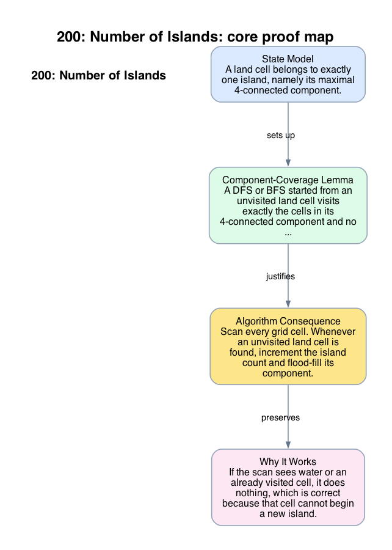

# 200: Number of Islands

- **Difficulty:** Medium
- **Tags:** Array, Depth-First Search, Breadth-First Search, Union Find
- **Pattern:** Connected-component traversal on a grid

## Fundamentals

### Problem Contract
Given a grid of `'1'` and `'0'`, count the number of 4-directionally connected components of land cells `'1'`. Adjacency is only vertical or horizontal.

### Definitions and State Model
A land cell belongs to exactly one island, namely its maximal 4-connected component.

Maintain a visited mark, either in a separate structure or by mutating the grid. When traversal starts from an unvisited land cell `(r, c)`, the traversal state is the frontier of that component.

### Key Lemma / Invariant / Recurrence
#### Component-Coverage Lemma
A DFS or BFS started from an unvisited land cell visits exactly the cells in its 4-connected component and no others.

Reason: every traversal step stays within the grid and moves only to adjacent land cells, so it cannot leave the component; conversely every cell in the component is reachable by a chain of such moves and will eventually be discovered.

### Algorithm
Scan every grid cell. Whenever an unvisited land cell is found, increment the island count and flood-fill its component.

```text
count = 0
for each cell (r, c):
    if grid[r][c] == '1':
        count += 1
        dfs(r, c)

dfs(r, c):
    if out of bounds or grid[r][c] != '1':
        return
    grid[r][c] = '0'
    dfs(r+1, c)
    dfs(r-1, c)
    dfs(r, c+1)
    dfs(r, c-1)
```

### Correctness Proof
If the scan sees water or an already visited cell, it does nothing, which is correct because that cell cannot begin a new island.

If the scan sees an unvisited land cell `(r, c)`, the component-coverage lemma shows that the DFS marks exactly the island containing `(r, c)`. Incrementing the answer once at that moment counts that island exactly once. No later scan step can count it again because all of its cells have been marked visited.

Every island contains at least one cell, and the first time the scan reaches any cell of that island, that cell is unvisited land, so the algorithm counts it. Therefore the final count equals the number of islands.

### Complexity Analysis
Let the grid size be `m x n`.

- Each cell is visited at most once.
- Each visit performs `O(1)` work plus up to four neighbor checks.

The running time is `O(mn)`. The auxiliary space is `O(mn)` in the worst case for recursion depth or an explicit traversal queue.

## Appendix

### Visuals

#### 1. Core Proof Map
This image is the required appendix visual for the note.

<div align="center">
  
</div>

This diagram compresses the state model, key claim, and algorithm consequence into one view so the proof spine is easier to reconstruct from memory.

### Common Pitfalls
- Counting diagonal neighbors merges distinct islands because the problem uses only 4-directional adjacency.
- Forgetting to mark a cell before recursing can revisit it through a neighbor and create exponential blowup.
