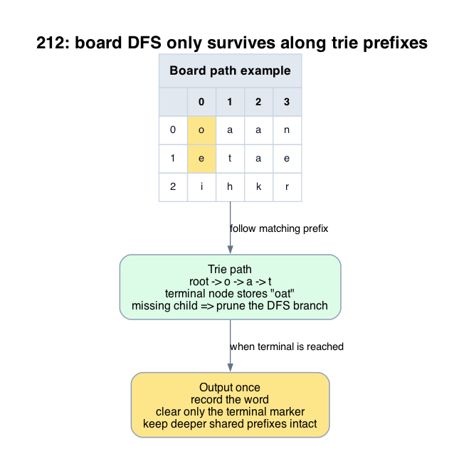

# 212: Word Search II

- **Difficulty:** Hard
- **Tags:** Array, String, Backtracking, Trie, Matrix
- **Pattern:** Trie-pruned multiword DFS

## Fundamentals

### Problem Contract
Given a character grid and a list of words, return every word that can be formed by a horizontal or vertical path using each cell at most once per word occurrence.

### Definitions and State Model
Build a trie over the words. A DFS state is `(r, c, node)` where `node` is the trie node reached by the path spelled so far.

If the current board path is not a trie prefix, the search can stop immediately.

### Key Lemma / Invariant / Recurrence
#### Trie-Pruning Lemma
If the current trie node has no child for `board[r][c]`, then no word with the current path prefix exists in the dictionary, so every DFS branch below that state is useless.

#### Output-Once Rule
If a trie node stores a complete word, recording it and then clearing that terminal marker prevents duplicate output without losing other words that share the same prefix.

### Algorithm
1. Build a trie from all words.
2. Start DFS from each board cell.
3. Advance only along trie edges that match the board characters.
4. Record completed words when a terminal trie node is reached.

```text
build trie
for each cell (r, c):
    dfs(r, c, trie_root)

dfs(r, c, node):
    ch = board[r][c]
    if ch not in node.children:
        return
    nxt = node.children[ch]
    if nxt.word is not null:
        record nxt.word
        nxt.word = null
    mark (r, c) as used
    for each 4-neighbor (nr, nc):
        if inside grid and not used:
            dfs(nr, nc, nxt)
    unmark (r, c)
```

### Correctness Proof
The trie-pruning lemma guarantees that every DFS branch kept alive still matches at least one dictionary prefix, so pruning never removes a branch that could finish a valid word.

If the DFS reaches a terminal trie node, the board path from its start cell spells exactly that stored word, so recording it is correct. Clearing the terminal marker preserves correctness because any future occurrence of the same word would be a duplicate in the output set, while longer words sharing the prefix remain represented by deeper trie nodes.

Conversely, any dictionary word that appears in the board defines a path whose prefixes are all trie prefixes, so the DFS from its first cell follows those trie edges and eventually reaches the terminal node for that word. Therefore every valid word is found.

### Complexity Analysis
Let `m x n` be the board size and let `S = sum(len(word))` over all words. Let `Lmax` be the maximum word length.

- Building the trie costs `O(S)`.
- In the worst case, DFS from each cell can explore `O(4 * 3^(Lmax-1))` states, though trie pruning is usually much stronger in practice.

A standard worst-case bound is `O(S + mn * 4 * 3^(Lmax-1))`. The auxiliary space is `O(S + Lmax)` for the trie and recursion path, excluding output.

## Appendix

### Visuals

#### 1. Trie Prefixes Prune The Board Search
This image is the required appendix visual for the note.

<div align="center">
  
</div>

The image focuses on the real optimization: DFS continues only while the current board path is also a trie prefix, and a missing child kills the whole branch immediately.

### Common Pitfalls
- Running Word Search I independently for every word repeats the same board exploration many times.
- Removing a trie node as soon as one word is found can break longer words that share that prefix; only the terminal word marker should be cleared unless the subtree becomes empty.
