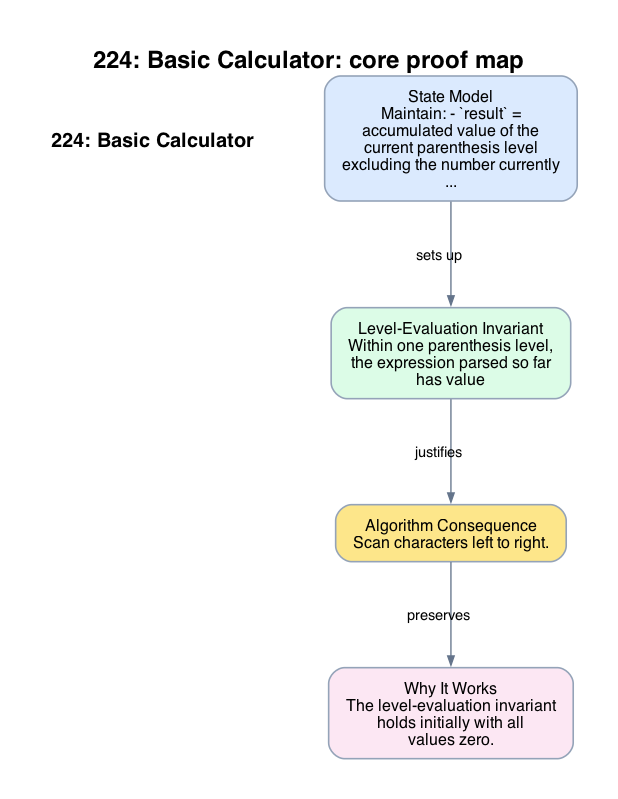

# 224: Basic Calculator

- **Difficulty:** Hard
- **Tags:** Math, String, Stack
- **Pattern:** Stack-based expression evaluation with sign contexts

## Fundamentals

### Problem Contract
Evaluate an arithmetic expression containing integers, `'+'`, `'-'`, parentheses, and spaces. Unary minus is allowed through expressions such as `-(...)` or `-3`.

There are no `'*'` or `'/'` operators, so only addition, subtraction, and parenthesized grouping matter.

### Definitions and State Model
Maintain:
- `result` = accumulated value of the current parenthesis level excluding the number currently being parsed,
- `sign` in `{+1, -1}` for the next parsed number or subexpression,
- `num` = the current multi-digit number,
- a stack storing pairs `(previous_result, previous_sign)` when entering a parenthesized subexpression.

### Key Lemma / Invariant / Recurrence
#### Level-Evaluation Invariant
Within one parenthesis level, the expression parsed so far has value
```text
result + sign * num
```
where `num` is the not-yet-committed current literal.

#### Parenthesis-Collapse Lemma
When a closing parenthesis is reached, the current level value `value = result + sign * num` is exactly the number that should be multiplied by the saved sign and added to the saved outer result:
```text
collapsed = previous_result + previous_sign * value.
```

### Algorithm
Scan characters left to right.

```text
result = 0
sign = 1
num = 0
stack = []
for ch in expression:
    if ch is digit:
        num = 10 * num + int(ch)
    elif ch in ['+', '-']:
        result += sign * num
        num = 0
        sign = +1 if ch == '+' else -1
    elif ch == '(':
        stack.push((result, sign))
        result = 0
        sign = 1
        num = 0
    elif ch == ')':
        result += sign * num
        num = 0
        prev_result, prev_sign = stack.pop()
        result = prev_result + prev_sign * result
    else:
        continue
return result + sign * num
```

### Correctness Proof
The level-evaluation invariant holds initially with all values zero.

Parsing a digit extends `num`, so the invariant still represents the parsed prefix. On `'+'` or `'-'`, committing `sign * num` into `result` correctly finalizes the previous term and updates the sign for the next term. On `'('`, saving `(result, sign)` records exactly the context needed to treat the subexpression as the next signed term in the outer level. On `')'`, the parenthesis-collapse lemma shows that the inner level's value becomes one signed term in the outer level, so popping and combining is correct.

After the scan, one final commit of `sign * num` completes the whole expression. Thus the algorithm returns the correct arithmetic value.

### Complexity Analysis
Let `n` be the expression length.

- The scan visits each character once.
- Each stack push or pop is `O(1)`.

The running time is `O(n)`. The auxiliary space is `O(n)` in the worst case for nested parentheses.

## Appendix

### Visuals

#### 1. Core Proof Map
This image is the required appendix visual for the note.

<div align="center">
  
</div>

This diagram compresses the state model, key claim, and algorithm consequence into one view so the proof spine is easier to reconstruct from memory.

### Common Pitfalls
- Forgetting to commit the pending `num` before processing an operator or right parenthesis loses the last parsed literal.
- A direct left-to-right subtraction without sign context fails on nested expressions such as `1-(2-3)`.
