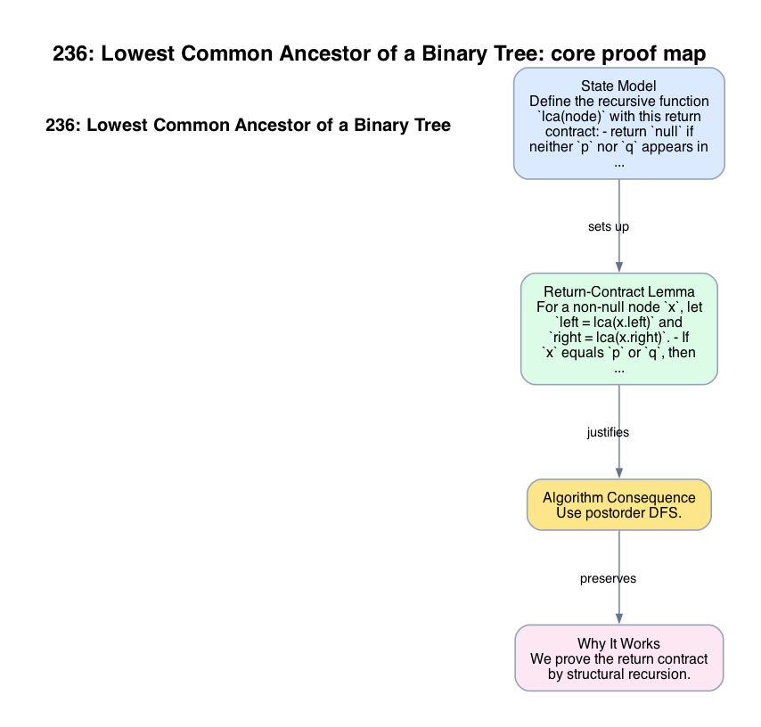

# 236: Lowest Common Ancestor of a Binary Tree

- **Difficulty:** Medium
- **Tags:** Tree, Depth-First Search
- **Pattern:** Recursive return-contract reasoning

## Fundamentals

### Problem Contract
Given a binary tree and two distinct nodes `p` and `q` that both appear in the tree, return their lowest common ancestor: the deepest node whose subtree contains both `p` and `q`.

### Definitions and State Model
Define the recursive function `lca(node)` with this return contract:
- return `null` if neither `p` nor `q` appears in the subtree of `node`,
- return `p` or `q` if exactly one of them appears and no lower common ancestor exists in that subtree,
- return the lowest common ancestor if both appear in that subtree.

### Key Lemma / Invariant / Recurrence
#### Return-Contract Lemma
For a non-null node `x`, let `left = lca(x.left)` and `right = lca(x.right)`.
- If `x` equals `p` or `q`, then `x` itself satisfies the return contract for its subtree unless a lower recursive call has already returned the LCA.
- If both `left` and `right` are non-null, then one target lies in each subtree, so `x` is their lowest common ancestor.
- If exactly one of `left` or `right` is non-null and `x` is neither target, propagate that non-null value upward.

### Algorithm
Use postorder DFS.

```text
lca(node):
    if node is null:
        return null
    if node == p or node == q:
        return node
    left = lca(node.left)
    right = lca(node.right)
    if left and right:
        return node
    return left if left else right

return lca(root)
```

### Correctness Proof
We prove the return contract by structural recursion.

For `node = null`, returning `null` is correct because the empty subtree contains neither target.

Now consider non-null `x`. If `x` equals `p` or `q`, the function returns `x`. This is correct because `x`'s subtree contains at least one target, and if the other target is below `x`, then `x` is already the lowest node whose subtree contains both.

Otherwise, recurse on both children. If both recursive calls return non-null, then one target was found in each subtree. No descendant of `x` can contain both targets, because the targets are split across the two child subtrees. Therefore `x` is the lowest common ancestor. If exactly one side returns non-null, then both targets are not split at `x`, so the only possible ancestor candidate already lies in that returning subtree, and propagating it is correct. This establishes the return contract at every node. Evaluated at the root, the function returns the desired LCA.

### Complexity Analysis
Let `n` be the number of nodes.

- Each node is visited at most once.
- Each visit does `O(1)` local work.

The running time is `O(n)`. The auxiliary space is `O(h)` for recursion depth.

## Appendix

### Visuals

#### 1. Core Proof Map
This image is the required appendix visual for the note.

<div align="center">
  
</div>

This diagram compresses the state model, key claim, and algorithm consequence into one view so the proof spine is easier to reconstruct from memory.

### Common Pitfalls
- Building explicit parent pointers is valid, but it is not necessary once the recursive return contract is understood.
- Returning the first node that matches `p` or `q` without combining left and right results misses the split-subtree case.
