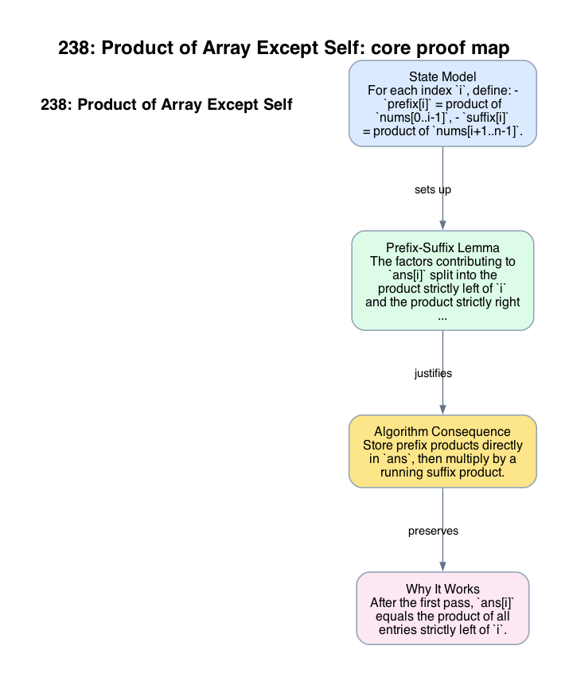

# 238: Product of Array Except Self

- **Difficulty:** Medium
- **Tags:** Array, Prefix Sum
- **Pattern:** Prefix-suffix decomposition without division

## Fundamentals

### Problem Contract
Given `nums[0..n-1]`, return an array `ans` where
```text
ans[i] = product of all nums[j] with j != i.
```
The intended solution avoids division.

### Definitions and State Model
For each index `i`, define:
- `prefix[i]` = product of `nums[0..i-1]`,
- `suffix[i]` = product of `nums[i+1..n-1]`.

Then
```text
ans[i] = prefix[i] * suffix[i].
```

### Key Lemma / Invariant / Recurrence
#### Prefix-Suffix Lemma
The factors contributing to `ans[i]` split into the product strictly left of `i` and the product strictly right of `i`, and these two sets are disjoint. Therefore multiplying the two directional products reconstructs exactly the desired product.

### Algorithm
Store prefix products directly in `ans`, then multiply by a running suffix product.

```text
ans[0] = 1
for i in 1 .. n-1:
    ans[i] = ans[i-1] * nums[i-1]

suffix = 1
for i in n-1 down to 0:
    ans[i] *= suffix
    suffix *= nums[i]
return ans
```

### Correctness Proof
After the first pass, `ans[i]` equals the product of all entries strictly left of `i`. This is immediate by induction on `i`.

During the second pass, `suffix` equals the product of all entries strictly right of the current index `i`. Multiplying `ans[i]` by `suffix` therefore applies the prefix-suffix lemma and yields exactly the product of all entries except `nums[i]`.

Every index is processed once in each pass, so every `ans[i]` is correct when returned.

### Complexity Analysis
Let `n = len(nums)`.

- Each pass scans the array once.
- Each step performs `O(1)` multiplication.

The running time is `O(n)`. The auxiliary space is `O(1)` beyond the output array.

## Appendix

### Visuals

#### 1. Core Proof Map
This image is the required appendix visual for the note.

<div align="center">
  
</div>

This diagram compresses the state model, key claim, and algorithm consequence into one view so the proof spine is easier to reconstruct from memory.

### Common Pitfalls
- Division-based formulas break on zero entries and ignore the intended constraint.
- Updating `suffix` before multiplying `ans[i]` would incorrectly include `nums[i]` in its own exclusion product.
