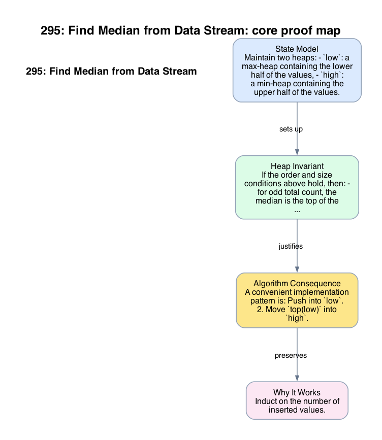

# 295: Find Median from Data Stream

- **Difficulty:** Hard
- **Tags:** Heap, Design, Data Stream
- **Pattern:** Two heaps with order and size invariants

## Fundamentals

### Problem Contract
Design a data structure supporting:
- `addNum(x)`: insert one number,
- `findMedian()`: return the median of all inserted values.

### Definitions and State Model
Maintain two heaps:
- `low`: a max-heap containing the lower half of the values,
- `high`: a min-heap containing the upper half of the values.

The intended state is:
- every value in `low` is at most every value in `high`,
- `|size(low) - size(high)| <= 1`,
- `low` is allowed to hold the extra element when the total count is odd.

### Key Lemma / Invariant / Recurrence
#### Heap Invariant
If the order and size conditions above hold, then:
- for odd total count, the median is the top of the larger heap, which by convention is `top(low)`;
- for even total count, the median is the average of `top(low)` and `top(high)`.

#### Rebalancing Lemma
After inserting a new value into the appropriate heap, moving the top element from one heap to the other restores the size condition in `O(log n)` time, while preserving the order condition.

### Algorithm
A convenient implementation pattern is:
1. Push into `low`.
2. Move `top(low)` into `high`.
3. If `high` becomes larger, move `top(high)` back into `low`.

```text
addNum(x):
    push x into low
    push pop_max(low) into high
    if size(high) > size(low):
        push pop_min(high) into low

findMedian():
    if size(low) > size(high):
        return top(low)
    return (top(low) + top(high)) / 2
```

### Correctness Proof
Induct on the number of inserted values. Initially both heaps are empty and the invariant holds trivially.

Assume the invariant holds before `addNum(x)`. Pushing `x` into `low`, then moving the maximum of `low` into `high`, ensures that every element remaining in `low` is at most the moved element and hence at most every element in `high`. If this makes `high` larger, moving its minimum back to `low` restores the size condition while preserving order, because that moved value is still at least every element already in `low`.

Thus `addNum` preserves the heap invariant. Once the invariant holds, `findMedian` is correct by the heap invariant lemma: the tops of the heaps are precisely the middle boundary values of the sorted multiset.

### Complexity Analysis
After `n` insertions:
- each heap push or pop costs `O(log n)`,
- `addNum` performs a constant number of heap operations,
- `findMedian` reads heap tops in `O(1)`.

Therefore `addNum` runs in `O(log n)` time, `findMedian` runs in `O(1)` time, and the space usage is `O(n)`.

## Appendix

### Visuals

#### 1. Core Proof Map
This image is the required appendix visual for the note.

<div align="center">
  
</div>

This diagram compresses the state model, key claim, and algorithm consequence into one view so the proof spine is easier to reconstruct from memory.

### Common Pitfalls
- Rebalancing only by size is not enough; the order invariant between heaps must also be maintained.
- Storing all values in one sorted array gives `O(1)` median queries but `O(n)` insertion time.
