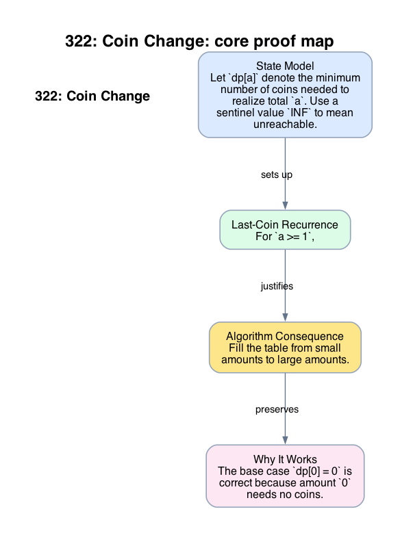

# 322: Coin Change

- **Difficulty:** Medium
- **Tags:** Array, Dynamic Programming, Breadth-First Search
- **Pattern:** Min-DP with unbounded choices

## Fundamentals

### Problem Contract
Given coin denominations `coins` and a nonnegative integer `amount`, return the minimum number of coins needed to make total `amount`. If no combination realizes `amount`, return `-1`.

Each coin denomination may be used arbitrarily many times.

### Definitions and State Model
Let `dp[a]` denote the minimum number of coins needed to realize total `a`. Use a sentinel value `INF` to mean unreachable.

The base state is
```text
dp[0] = 0,
dp[a] = INF for a > 0 before relaxation.
```

### Key Lemma / Invariant / Recurrence
#### Last-Coin Recurrence
For `a >= 1`,
```text
dp[a] = min(1 + dp[a - c]) over coins c with c <= a.
```
This is correct because any optimal solution for amount `a` has a last coin `c`; removing that last coin leaves a subproblem of size `a-c`. Conversely, appending `c` to any optimal solution for `a-c` yields a feasible solution for `a`.

### Algorithm
Fill the table from small amounts to large amounts.

```text
INF = amount + 1
dp = [INF] * (amount + 1)
dp[0] = 0
for a in 1 .. amount:
    for c in coins:
        if c <= a:
            dp[a] = min(dp[a], 1 + dp[a-c])
if dp[amount] == INF:
    return -1
return dp[amount]
```

### Correctness Proof
The base case `dp[0] = 0` is correct because amount `0` needs no coins.

Assume all values `dp[0], ..., dp[a-1]` are already correct. Any feasible way to form `a` has some last coin `c`, so its total number of coins equals `1 +` the number needed for `a-c`. By induction, the best such value is `1 + dp[a-c]`. Taking the minimum over all allowable last coins therefore yields the optimal count for `a`. If no coin leads to a reachable subamount, then `dp[a]` remains `INF`, correctly marking `a` unreachable.

By induction over `a`, the entire table is correct, so the algorithm returns the minimum number of coins for `amount`, or `-1` when unreachable.

### Complexity Analysis
Let `n = len(coins)`.

- The outer loop runs `amount` times.
- The inner loop scans all `n` coin types.
- Each update is `O(1)`.

The running time is `O(n * amount)`. The auxiliary space is `O(amount)`.

## Appendix

### Visuals

#### 1. Core Proof Map
This image is the required appendix visual for the note.

<div align="center">
  
</div>

This diagram compresses the state model, key claim, and algorithm consequence into one view so the proof spine is easier to reconstruct from memory.

### Common Pitfalls
- Greedily taking the largest denomination first fails for systems such as `coins = [1, 3, 4]`, `amount = 6`.
- Using `INF = float('inf')` is fine, but an integer sentinel such as `amount + 1` keeps all states in the same numeric domain.
